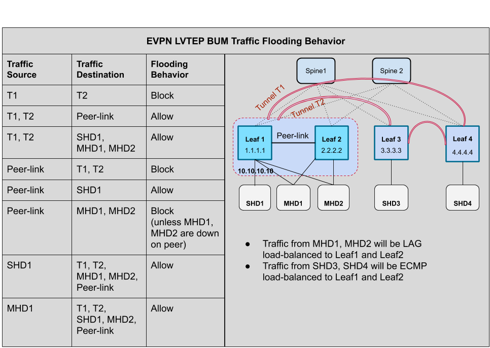
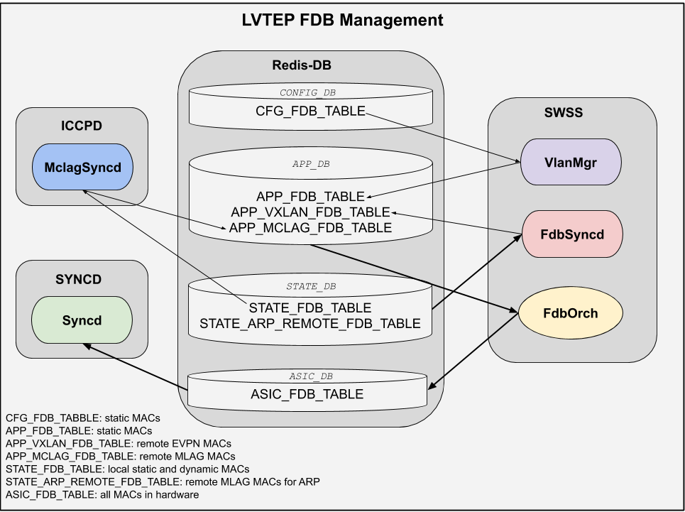
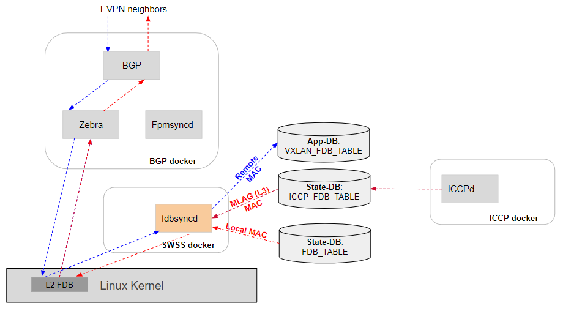
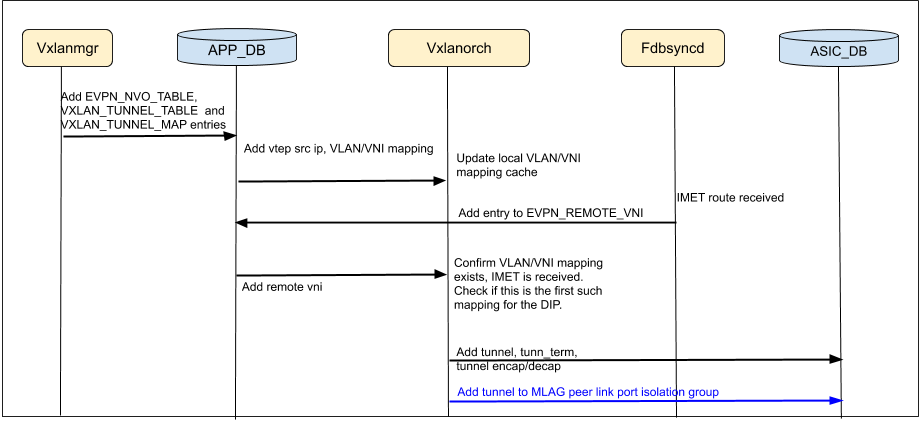
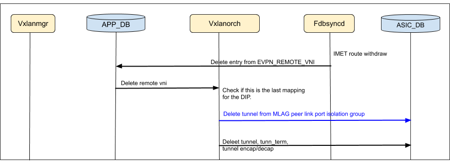
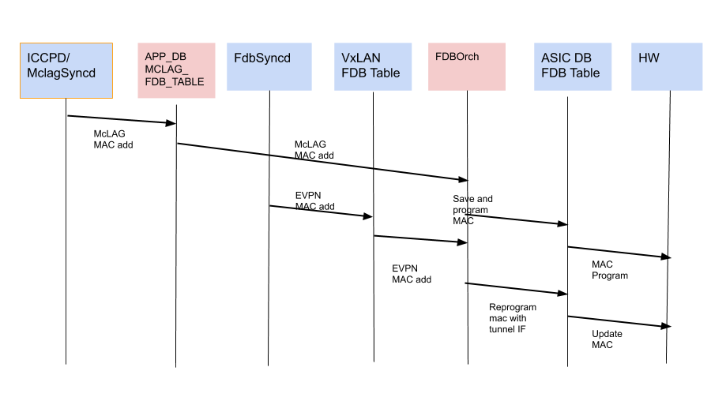
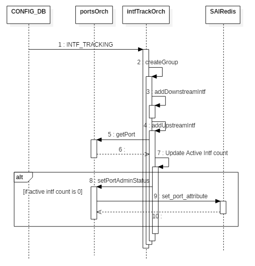

# EVPN Logical VXLAN Tunnel End Point
# High Level Design Document
Rev 1.0

# Table of Contents
- **[List of Tables](#list-of-tables)**
- **[Revision](#revision)**
- **[About this Manual](#about-this-manual)**
- **[Scope](#scope)**
- **[Definition/Abbreviation](#definition_abbreviation)**
	- [Table 1: Abbreviations](#table-1-abbreviations)
- **[1 Feature Overview](#1-feature-overview)**
	- [1.1 Requirements](#11-requirements)
		- [1.1.1 Functional Requirements](#111-functional-requirements)
		- [1.1.2 Configuration and Management Requirements](#112-configuration-and-management-requirements)
		- [1.1.3 Scalability Requirements](#113-scalability-requirements)
		- [1.1.4 Warm Boot Requirements](#114-warm-boot-requirements)
		- [1.1.5 Notes:](#115-notes)
	- [1.2 Design Overview](#12-design-overview)
		- [1.2.1 Basic Approach](#121-basic-approach)
		- [1.2.2 Container](#122-container)
		- [1.2.3 SAI Overview](#123-sai-overview)
- **[2 Functionality](#2-functionality)**
	- [2.1 Target Deployment Use Cases](#21-target-deployment-use-cases)
	- [2.2 Functional Description](#22-functional-description)
		- [2.2.1 Traffic Forwarding Behavior](#221-traffic-forwarding-behavior)
		- [2.2.2 MAC Management](#222-mac-management)
		- [2.2.3 Uplink Interface Tracking](#223-uplink-interface-tracking)
		- [2.2.4 Startup Delay Restore](#224-startup-delay-restore)
- **[3 Design](#3-design)**
	- [3.1 Overview](#31-overview)
	- [3.2 DB Changes](#32-db-changes)
		- [3.2.1 CONFIG DB](#321-config-db)
			- *[3.2.1.1 Interface Tracking Table](#3211-interface-tracking-table)*
		- [3.2.2 APP DB](#322-app-db)
		- [3.2.3 STATE DB](#323-state-db)
		- [3.2.4 ASIC DB](#324-asic-db)
		- [3.2.5 COUNTER DB](#325-counter-db)
	- [3.3 Switch State Service Design](#33-switch-state-service-design)
		- [3.3.1 VxlanOrch Changes](#331-vxlanorch-changes)
		- [3.3.2 FdbOrch Changes](#332-fdborch-changes)
		- [3.3.3 IntfTrackOrch](#333-intftrackorch)
			- *[3.3.3.1 IntfTrackOrch class](#3331-intftrackorch-class)*
			- *[3.3.3.2 IntfTrackGroup class](#3332-intftrackgroup-class)*
		- [3.3.4 PortsOrch changes](#334-portsorch-changes)
		- [3.3.5 FdbSyncD](#335-fdbsyncd)
	- [3.4 SAI](#34-sai)
	- [3.5 CLI](#35-cli)
		- [3.5.1 IS-CLI Compliance](#351-is-cli-compliance)
		- [3.5.2 Data Models](#352-data-models)
		- [3.5.3 Configuration Commands](#353-configuration-commands)
			- *[3.5.3.1 Using Klish CLIs](#3531-using-klish-clis)*
			- *[3.5.3.2 Using Click CLIs](#3532-using-click-clis)*
			- *[3.5.3.3 Delay Restore Klish CLI](#3533-delay-restore-klish-cli)*
		- [3.5.4 Show Commands](#354-show-commands)
			- *[3.5.4.1 show interface tracking](#3541-show-interface-tracking)*
			- *[3.5.4.2 Show delay restore timer](#3542-show-delay-restore-timer)*
		- [3.5.5 Debug Commands](#355-debug-commands)
		- [3.5.6 REST API Support](#356-rest-api-support)
- **[4 Flow Diagrams](#4-flow-diagrams)**
	- [4.1 LVTEP Tunnel Add](#41-lvtep-tunnel-add)
	- [4.2 LVTEP Tunnel Delete](#42-lvtep-tunnel-delete)
	- [4.3 MAC Addition from EVPN and ICCP](#43-mac-addition-from-evpn-and-iccp)
	- [4.4 MAC Deletion from BGP EVPN and ICCP](#44-mac-deletion-from-bgp-evpn-and-iccp)
	- [4.5 Interface tracking group create](#45-interface-tracking-group-create)
	- [4.6 Handling upstream interface operational status](#46-handling-upstream-interface-operational-status)
- **[5 Error Handling](#5-error-handling)**
- **[6 Serviceability and Debug](#6-serviceability-and-debug)**
- **[7 Warm Boot Support](#7-warm-boot-support)**
- **[8 Scalability](#8-scalability)**
- **[9 Unit Test](#9-unit-test)**
	- [9.1 Functional Test Cases](#91-functional-test-cases)
	- [9.2 Negative Test Cases](#92-negative-test-cases)
	- [9.3 Warm boot Test Cases](#93-warm-boot-test-cases)
- **[10 Configuration Example](#10-configuration-example)**

# List of Tables

[Table 1: Abbreviations](#table-1-abbreviations)

# Revision
| Rev  | Date       | Author              | Change Description                      |
| ---- | ---------- | ------------------- | --------------------------------------- |
| 0.1  | 08/13/2019 | Lisa Nguyen         | Initial version                         |
| 0.2  | 08/20/2019 | Abhishek Dharwadkar | Add Interface tracking details          |
| 0.3  | 08/25/2019 | Praveen Elagala     | Add Fdb handling details                |
| 0.4  | 8/26/2019  | Hasan Naqvi         | Add Fdbsyncd details                    |
| 1.0  | 8/30/2019  | Lisa Nguyen         | Add MAC Management diagram              |
| 1.1  | 12/18/2019 | Lisa Nguyen         | Update Serviceability and Debug section |
| 1.2  | 06/17/2020 | Lisa Nguyen         | Add startup delay restore details       |

# About this Manual
This document provides general information about EVPN Logical VTEP feature in SONiC.

# Scope
This document describes the high level design of EVPN Logical VTEP feature which is built upon MC-LAG and EVPN VXLAN features. This document references the existing MC-LAG HLD and EVPN VXLAN HLD where applicable. Hence, it is recommended that the users read those documents before this document. 

# Definition/Abbreviation
## Table 1: Abbreviations
| Term  | Meaning                                 |
| ----- | --------------------------------------- |
| BUM   | Broadcast Unknown Unicast and Multicast |
| EVI   | Ethernet VPN Instance                   |
| ICCP  | Inter-Chassis Communication Protocol    |
| IMET  | Include Multicast Ethernet Tag          |
| IRB   | Integrated Routing and Bridging         |
| LVTEP | Logical VXLAN Tunnel End Point          |
| MCLAG | Multi-Chassis Link Aggregation Group    |
| MHD   | Multi-Homed Device                      |
| NVO   | Network Virtualization Overlay          |
| SHD   | Single-Homed Device                     |
| VTEP  | VXLAN Tunnel End Point                  |
| VXLAN | Virtual Extended LAN                    |

# 1 Feature Overview

Logical VTEP (LVTEP) is used to refer to a set of multi-homing devices acting as a single logical device for VXLAN Tunnel End Point. With EVPN LVTEP, only auto-created VXLAN tunnel based on EVPN routes as specified in EVPN VXLAN HLD will be supported. The manually created tunnels and the L2 and L3 services over them as described in L2 VXLAN and VXLAN (VNET) HLDs are not supported. Dual-homing is supported using ICCP-based MCLAG as described in MC-LAG HLD. 

The term LVTEP will be used to refer to EVPN LVTEP and single VTEP will be used to refer to EVPN VXLAN throughout the document.

The diagram below provides a simple example of how LVTEP can be deployed in a leaf and spine IP fabric:


**Figure 1: EVPN LVTEP Overview**
In the above diagram:

- Leaf1 and Leaf2 forms a MCLAG pair as described in MCLAG HLD. 
- Leaf1 and Leaf2 acts as one logical leaf to remote leaf nodes (Leaf3 and Leaf4) with a common and reachable source VTEP IP address of 10.10.10.10
- Leaf 1 and Leaf2 each forms a BGP-EVPN session with remote leaf nodes (Leaf3 and Leaf4) using loopback address 1.1.1.1 and 2.2.2.2 respectively.
- Each remote leaf (Leaf3 and Leaf4) forms a single VXLAN tunnel to destination 10.10.10.10

Compare to physical VTEP where the two MCLAG nodes acts as two separate VTEPs to remote leaf nodes, LVTEP provides the following benefits:
- Provide better VXLAN tunnel scalability since remote leaf node has less number of VXLAN tunnel to manage. In addition, it also has less number of tunnels' ECMP nexthops to manage. 
- Provide better utilization of bandwidth since remote leaf node only floods one copy instead of N copies of BUM traffic where N is number of multi-homing leaves.
- Minimize BGP EVPN control plane changes since MCLAG leaf nodes do not need to advertise Ethernet Auto-Discovery (AD) per EVI routes and the remote leaf nodes did not need to process them. This in turn helps simplify network upgrade procedure since MCLAG leaf nodes and remote leaf node do not need to be upgraded at the same time.
- Provide better BGP EVPN control plane scalability in L2 VPN deployment since a large number of AD per EVI routes is not required to be exchanged in order to load balancing traffic to MHDs across MCLAG leaf nodes. 


## 1.1 Requirements

### 1.1.1 Functional Requirements

Since LVTEP is built upon EVPN VXLAN, it supports all the functionalities supported by EVPN VXLAN as described in EVPN VXLAN HLD. In addition, it has the following additional requirements that are applicable to both L2 and L3 traffic:
1. Support two MCLAG leaf nodes act as one logical VTEP.
2. Support MCLAG leaf nodes directly connect using a peer-link in a L2 deployment environment.
3. Support local forwarding of traffic received from SHDs and MHDs to remote leaf nodes without using the peer link. For L3 deployment, this is typically known as Static Anycast Gateway feature.
4. Support forwarding of traffic received from SHDs and MHDs to remote leaf nodes via peer-link if VXLAN tunnel to remote leaf node is down on MCLAG leaf node.
5. Support local termination of traffic received from remote leaf nodes and forward the traffic locally to SHD or MHD. 
6. Support local termination of traffic received from remote leaf nodes and forward the traffic via peer-link if and only if MCLAG interface to MHD is down. 
7. Support flooding of BUM traffic received from remote leaf nodes to MHD from a single MCLAG leaf node only.
8. Support uplink tracking feature where configured uplink interfaces will be monitored for their operational status. When all monitored interfaces are down, all local MCLAG interfaces will be brought down accordingly.
9. Support advertisement of locally learned MAC addresses on MCLAG leaf node to remote leaf nodes via BGP similar to single VTEP case.
10. Support learning of remote MAC addresses from remote leaf nodes via BGP similar to single VTEP case.
11. Support programming of remote MAC addresses learned via BGP but do not synchronize them to remote MCLAG peer via ICCP.
12. Support MAC move from SHD/MHD on MCLAG leaf node to SHD/MHD on a remote leaf node and vice versa.
13. Support ingress replication when sending BUM traffic across VXLAN tunnels and to MCLAG peer node

### 1.1.2 Configuration and Management Requirements
This feature supports CLI and other management interfaces supported in SONiC. It leverages existing CLIs specified in VXLAN and EVPN VXLAN HLDs. In addition, it has the following requirements on MCLAG leaf node:
1. Support configuration of the same IP address as tunnel source IP address and reference the tunnel name in the EVPN NVO configuration using existing CLIs and management interfaces defined in VXLAN and EVPN VXLAN HLDs.
2. Support configuration of uplink interfaces to be tracked for their operational status
3. Support enhancement to show interface status to indicate the interface is shutdown due to uplink  tracking feature. 

### 1.1.3 Scalability Requirements
LVTEP leaf scalability requirements are the same as single VTEP and MCLAG requirements. For TD3 platform, 
1. Max number of VTEP termination: 1

2. Max number of VTEP origination: 512

3. Max number of VLANs extended across MCLAG peers and to remote leaf nodes: 4K

4. Max number of L2 VNI: 4K

5. Max number of VRF/L3 VNI: TBD (to be added by L3/Protocol teams)

6. Max number of MACs: 40K

7. Max number of IPv4 and IPv4 routes: TBD (To be added by L3/Protocol teams)

8. Max number of MCLAG interfaces depends on max number of front-panel ports and max port-channels a platform can support 


### 1.1.4 Warm Boot Requirements
Warm reboot is intended to be supported for the following cases:
1. Planned system warm reboot
2. Planned SwSS docker restart
3. Planned BGP docker restart
4. Planned ICCP docker restart
5. Planned Teamd docker restart  

### 1.1.5 Notes:

1. It is required that all of the VLAN, Subnet, and VRF configurations are symmetric between the MCLAG peers. There is no validation check to detect configuration inconsistencies.

2. ICCP does not provide synchronization of L3 prefix routes between MLAG peers.

3. In the cases of asymmetric ip address configurations, orphan L3 ports, or dynamic routing confiugred in VRF on a given MCLAG pair, BGP VRF session is required between the MCLAG peers to synchronize VRF's L3 prefix routes.

   

## 1.2 Design Overview
### 1.2.1 Basic Approach
The code changes for LVTEP are newly developed.

### 1.2.2 Container
No new container will be added. The changes will be added to existing containers such as SwSS and Syncd. The details of the changes will be described in the Design section below.

### 1.2.3 SAI Overview
There is no new SAI API or SAI attribute required for this feature. The existing port isolation SAI API will be used to achieve BUM flooding behavior described in subsequent section.

# 2 Functionality

## 2.1 Target Deployment Use Cases
LVTEP can be deployed in the following use cases:
- Leaf nodes in IP Fabric Leaf and Spine Topology
- Data Center Interconnect (DCI) nodes where VXLAN is used to tunnel the traffic to remote data center and incoming traffic to DCI nodes can be L2 and L3.

## 2.2 Functional Description
### 2.2.1 Traffic Forwarding Behavior

Encapsulation and decapsulation for L2 and L3 traffic in symmetric and asymmetric IRB forwarding over VXLAN tunnel is the same as described in EVPN VXLAN HLD. Hence, it is not repeated in this document. 

The following diagram describes the traffic forwarding behavior for known unicast traffic:


**Figure 2: EVPN LVTEP L2/L3 Traffic Forwarding**
In the above diagram:

- Known unicast traffic from MHD1 to SHD3 can be LAG load-balanced to either MCLAG Leaf1 or Leaf2 as shown in Flow1 and Flow2 respectively. Leaf1 or Leaf2 will directly forward the traffic over VXLAN tunnel to Leaf3.
- Known unicast traffic from SHD4 to MHD1 can be ECMP load-balanced to either Leaf1 or Leaf2 who will directly forward the traffic to MHD1.


In the following digram, the table on the left describes the Broadcast, Unknown Unicast and Multicast traffic flooding behavior for Leaf1 node in the diagram on the right.



**Figure 3: EVPN LVTEP BUM Traffic Flooding**
In the above diagram, the table describes the BUM traffic flooding behavior on Leaf1 node in the topology on the right. Note that:

- BUM traffic received from local SHD, MHD, or VXLAN tunnel is always locally flooded to MHD unless its MCLAG interface is down
- BUM traffic received on peer-link is never flooded back to VXLAN tunnel. It is flooded to MHD only if the corresponding MCLAG interface is down on remote MCLAG peer node.

### 2.2.2 MAC Management

Loally learned MAC addresses on each LVTEP node are exchanged with remote leaf nodes using BGP EVPN control plane similar to single VTEP case as described in EVPN VXLAN HLD. In addition, they are also exchanged with MCLAG peer node using ICCP control plane as described in MC-LAG HLD. As part of LVTEP support, MAC move between MHD on LVTEP node and SHD/MHD on remote leaf node is also supported.



**Figure 4: EVPN LVTEP MAC Management**
### 2.2.3 Uplink Interface Tracking
In the following diagram,  if all the upstream links are down on Leaf1 node, all the traffic must be sent over to MCLAG peer node to reach Spine1 node. This would require the ICL link bandwidth to be large enough to handle the additional traffic as show in following figure.


**Figure 5: Traffic flow without Interface Tracking**
Interface tracking introduces a mechanism with which the traffic from MHD1 and MHD2 can be sent to Leaf2 which has reachability to the spine by shutting down the MCLAG interfaces as shown in the following figure.


**Figure 6: Traffic flow with Interface Tracking**
### 2.2.4 Startup Delay Restore
The startup behavior described in this section is applicable to the following scenarios:

- Node reboot triggered via reboot or fast-reboot command or system crash
- Config reload command 
- SwSS docker restart 

The startup behavior is applicable to a MCLAG node forming a logical VTEP, namely Leaf1 or Leaf2 described in EVPN LVTEP Overview diagram above. On startup, the users can configure a delay restore timer to keep the MCLAG interfaces connecting to MHDs and orphan interfaces connecting to SHDs to be down for the duration of the specified time. The holdown of the interfaces will allow protocol to converge and VxLAN tunnels to be formed between MLAG node and remote leaf nodes before allowing traffic from MHDs and SHDs to be sent to MCLAG node. The holddown helps minimize traffic loss for the traffic sent from MHDs and SHDs connecting to MCLAG node to remote leaf nodes.   

The delay restore logic will rely on the uplink interface tracking configuration to determine the MCLAG and orphan interfaces to be held down. In other words, uplink interface tracking must be configured in order for the delay restore timer to take effect. Below is the behavior of the delay restore timer:

- The delay restore timer will be started when the first IP interface in the system comes up. 
- While the timer is running, the MCLAG and orphan interfaces will be kept in operationally down state. The user can manually bring the interfaces up by shutting down and starting up the interfaces explicitly.
- When the timer expires, the operationally down MCLAG and orphan interfaces will be brought up.  
- By default, the timer is set to 300 seconds. This means delay restore is enabled by default. User needs to set the timer value to zero to disable it. 

Since the delay timer is used in startup scenarios where the system will take more time to convergence compared to the leaf-spine uplink flapping scenario, the users should configure delay restore timer with a higher value than the uplink interface tracking timer. 

# 3 Design

## 3.1 Overview
Since LVTEP is built upon EVPN VXLAN and MCLAG, the design from these two features are also extended with the following changes:
- Port-isolation group used in MCLAG to achieve source port suppression to MHD is extended to include VXLAN tunnel bridge port. The extension is required to achieve BUM traffic flooding behavior described in the EVPN LVTEP BUM Traffic Flooding Behavior diagram above.
- FdbOrch is extended to handle MAC move between LVTEP MHD and SHD/MHD attached to remote leaf node.
- Uplink interface tracking feature is introduced to direct traffic from MHDs to MCLAG peer node when all uplink interfaces from the MCLAG node have gone down.

## 3.2 DB Changes

### 3.2.1 CONFIG DB
#### 3.2.1.1 Interface Tracking Table

The following table is used to configure the interface tracking feature

```
key              = INTF_TRACKING:name            ; name must be unique
;field           = value
UPSTREAM         = [0-max_intfs]*intf_name
DOWNSTREAM       = "all-mclag"
TIMEOUT          = 1*3DIGIT    ; Timeout in seconds to bring up the downstream interfaces
                               ; when atleast 1 of the upstream interface is up.
DESCRIPTION      = 1*255VCHAR  ; Description for group

;value annotations
max_intfs = 1*5DIGIT ; Maximum number of interfaces supported by the switch
intf_name = "Ethernet"1-2DIGIT / "PortChannel"1*3DIGIT / "Vlan"1*4DIGIT
```

### 3.2.2 APP DB
Two new tables are added to APP_DB which allow uplink interface tracking and delay restore logic to control the operational status of the port and port-channel interfaces respectively.

```
PORT_APP_STATUS_TABLE
  Producer: IntfsOrch
  Consumer: PortsOrch

key                    = PORT_APP_STATUS_TABLE:ifname 
;field
iftrack_status         = ”up" / ”down”        ;uplink interface tracking status
delay_restore_status   = “up” / “down”        ;delay restore status
```

```
LAG_APP_STATUS_TABLE
  Producer: IntfsOrch
  Consumer: TeamMgr
  
key                    = LAG_APP_STATUS_TABLE:lagname
;field
iftrack_status         = ”up" / ”down”         ;uplink interface tracking status
delay_restore_status   = “up” / “down          ;delay restore status
```

### 3.2.3 STATE DB

There is no change to STATE DB

### 3.2.4 ASIC DB

There is no change to ASIC DB

### 3.2.5 COUNTER DB

There is no change to COUNTER DB

## 3.3 Switch State Service Design

### 3.3.1 VxlanOrch Changes
VxlanOrch processing for dynamic tunnel creation and deletion logic is updated to add and remove the VXLAN tunnel bridge port to and from the peer-link port isolation group respectively if the isolation group exists. If peer-link port isolation group is not created by MCLAG yet, the first tunnel creation should trigger port isolation group creation. Similarly, if port isolation group is no longer used by MCLAG when the last tunnel is deleted, the port isolation group should be deleted.

### 3.3.2 FdbOrch Changes
To support the MAC move scenarios between the remote leaf nodes and MCLAG leaf nodes, FdbOrch will be extended to keep track of the learn source for the advertised MAC addresses. Below are the rules that FdbOrch will follow for the MAC address programming when the same MAC address is learned from multiple sources. Precedence is considered in the order below starting with highest precedence. 

1. In presence of local static MAC address along with other advertised MAC addresses , FdbOrch gives highest precedence  to the local static MAC which will be programmed in the hardware. Mac move is not allowed when the local static MAC is the chose MAC. 
2. In presence of advertised static MAC address learned from remote VTEP node via BGP EVPN or learned from MCLAG peer node via ICCP, FdbOrch will program the remote static MAC. MAC move is not allowed when the advertised MAC is chosen MAC for programming.
3. In presence of dynamic MAC address locally learned on connected SHD or MHD  or learned as advertised MAC address from remote leaf nodes via BGP EVPN or ICCP,  the MAC addresses that is processed last on the FdbOrch will be programmed in hardware. 

When MAC address delete notification is processed, FdbOrch will mark the delete only for the corresponding learn source , if the MAC is learned from other sources then FdbOrch will reprogram the MAC address with the port information of new learn source chosen. For example, when a MAC address is initially learned from McLAG peer node, and later learned from from remote leaf node via BGP EVPN. EVPN MAC would have been chosen by FdbOrch for programming. When remote leaf node withdraws the MAC address then FdbOrch to re-program the MAC as McLAG advertised MAC.   

### 3.3.3 IntfTrackOrch

A new Orch agent called IntfTrackOrch (Interface Tracking Orch Agent) will be introduced to support interface tracking feature. IntfTrackOrch will utilize the  operation status information from PortOrch to bring down the downstream ports. IntfTrackOrch will subscribe to `MC_LAG` table and build a list of MCLAG interfaces using value of `mclag_interface` column.

#### 3.3.3.1 IntfTrackOrch class

```c++
class IntfTrackOrch: public Orch
{
    public:
        void doTask();
        
    ...
    
    private:
        map<string, IntfTrackGroup> m_trackGrps;
};
```

#### 3.3.3.2 IntfTrackGroup class

```c++
class IntfTrackGroup
{
    public:
    
    private:
        string m_name;
        map<string, bool> m_upstream; // Upstream interfaces
        vector<string> m_downsteam; // Downstream interfaces
        bool m_all_mclag; // All MCLAG intf. m_downstream will be populated internally
        uint32_t m_timeout; // Timeout to bringup the downstream links. Default=60s
};
```

### 3.3.4 PortsOrch changes
No change to PortsOrch. Shutdown of the downstream interfaces will be achieved by setting admin_status in Config DB to down.

### 3.3.5 FdbSyncD

FdbsyncD will take care of synchronizing the Local and ICCP remote MAC addresses to Linux L2 FDB table. A new ICCP_FDB_TABLE table is introduced to synchronize L3 MAC addresses (i.e. bound to ARP/ND) received from ICCPd to the Linux L2 Fdb table.



**Figure 7: MAC Handling in FdbsyncD**
In the above diagram, Fdbsyncd listens to Kernel L2 Fdb events and programs VxLAN remote MAC addresses into VXLAN_FDB_TABLE. When a MAC is learned in the forwarding plane, Fdbsyncd will receive notification from STATE_FDB_TABLE and will program Local MAC address into Linux L2 Fdb. Zebra in BGP docker listens to Kernel L2 FDB events and will redistribute the local MAC into EVPN control plane.

Typical MAC move scenarios handled by Fdbsyncd are listed below:

1. VxLAN to local/ICCP

   When remote EVPN MAC is installed in Kernel L2 Fdb table by Zebra and Fdbsyncd receives MAC add notification from STATE_FDB_TABLE or ICCP_FDB_TABLE, it will remove the previously installed remote EVPN MAC address from VXLAN_FDB_TABLE and will install Local/ICCP MAC into Kernel. FRR will treat this event as MAC move (to Local) and will re-advertise EVPN MAC route after incrementing the sequence number in Type-2 BGP update messages.

2. Local to ICCP

   When Local MAC address is already installed by Fdbsyncd based on STATE_FDB_TABLE, and MAC add notification is received from ICCP_FDB_TABLE, Fdbsyncd will replace the entry in Kernel L2 Fdb table with ICCP MAC. Similarly, when MAC delete notification is received from STATE_FDB_TABLE, Fdbsyncd will install ICCP MAC into Kernel FDB if it had previously received same MAC from ICCP_FDB_TABLE.

3. ICCP to Local

   When MAC delete notification is received from ICCP_FDB_TABLE, and MAC add notification had been previously received from STATE_FDB_TABLE, Fdbsyncd will install Local MAC into Kernel.

4. Local/ICCP to VxLAN

   In case Local or ICCP MAC address is installed in Linux L2 Fdb table, and VxLAN MAC add notification is received from Kernel, Fdbsyncd will install VxLAN MAC into VXLAN_FDB_TABLE. If same MAC had been previously received from ICCP_FDB_TABLE or STATE_FDB_TABLE, those entries will not be modified. Fdborch will take care of moving the Local/ICCP MAC to remote and removal of Local MAC from STATE_FDB_TABLE.

In all of the above cases, Fdbsyncd updates the Kernel L2 Fdb table based on the event as it is received. It does not perform any best MAC selection to chose which MAC address to prefer for installation when same MAC add is received from multiple sources. The last event would reflect the MAC state.

## 3.4 SAI

Broadcom SAI implementation for port isolation group will be extended to support VXLAN bridge port as one of the members of the isolation group. On TD3, the split horizon table will be used to achieve the BUM flooding behavior described in previous section. The normal attachement circuit (AC), peer link AC, and VXLAN tunnel logical interfaces will be assigned unique network group IDs. The incoming and outgoing network group IDs are used to decide whether a packet can be forwarded to dropped. 

## 3.5 CLI
### 3.5.1 IS-CLI Compliance
### 3.5.2 Data Models

OpenConfig MCLAG yang model is updated to support delay restore timer configured under MCLAG domain

```
openconfig-mclag
  +--rw mclag
     +--rw config
     +--ro state
     +--rw mclag-domains
     |  +--rw mclag-domain* [domain-id]
     |     +--rw domain-id    -> ../config/domain-id
     |     +--rw config
     |     |  +--rw domain-id?            uint32
     |     |  +--rw source-address?       oc-inet:ip-address
     |     |  +--rw peer-address?         oc-inet:ip-address
     |     |  +--rw peer-link?            string
     |     |  +--rw mclag-system-mac?     oc-yang:mac-address
     |     |  +--rw keepalive-interval?   uint32
     |     |  +--rw session-timeout?      uint32
     |     |  +--rw delay-restore?        uint16
     |     +--ro state
     |        +--ro domain-id?            uint32
     |        +--ro source-address?       oc-inet:ip-address
     |        +--ro peer-address?         oc-inet:ip-address
     |        +--ro peer-link?            string
     |        +--ro mclag-system-mac?     oc-yang:mac-address
     |        +--ro keepalive-interval?   uint32
     |        +--ro session-timeout?      uint32
     |        +--ro delay-restore?        uint16
     |        +--ro oper-status?          enumeration
     |        +--ro role?                 enumeration
     |        +--ro system-mac?           oc-yang:mac-address
```


### 3.5.3 Configuration Commands

The following commands will be used to configure tracking group. The group will be created to track L3 interface.

#### 3.5.3.1 Using Klish CLIs

**Add linktrack group**
```
sonic(config)# link state track NAME
```

**Set a description for the group**
```
sonic(config-link-track)# [no] description STRING
```

**Set downstream port bringup timeout**
```
sonic(config-link-track)# timeout <1-999>
```

**Set downstream to all MCLAGs**
```
sonic(config-link-track)# downstream all-mclag
```

**Set upstream interfaces**
```
sonic(config)# interface (Ethernet|PortChannel|Vlan) PORTNUM
sonic(config-if) link state group NAME upstream
```

**Set orphan downstream ports**
```
sonic(config)# interface (Ethernet|PortChannel) PORTNUM
sonic(config-if) link state group NAME downstream
```

#### 3.5.3.2 Using Click CLIs

**config linktrack add** 

```
admin@sonic:~$ sudo config linktrack add --help
Usage: config linktrack add [OPTIONS] <name>

  Add Interface tracking group 

Options:
  -u, --upstream <upstream>      Set upstream interfaces
  -d, --downstream <downstream>  Set downstream ports. Use port/lag names or 
                                 all-mclag
  -t, --timeout <timeout>        Set timeout value in seconds
  --description <description>    Set group description
  -?, -h, --help                 Show this message and exit. 
```

**config linktrack del** 

```
admin@sonic:~$ sudo config linktrack del --help
Usage: config linktrack del [OPTIONS] <name>

  Delete Interface tracking group 

Options:
  -?, -h, --help  Show this message and exit.
```

**config linktrack update**

```
admin@sonic:~$ sudo config linktrack update --help
Usage: config linktrack update [OPTIONS] <name>

  Update Interface tracking group

Options:
  -u, --upstream <upstream>       Set upstream interfaces
  -nu, --no-upstream <upstream>   Remove upstream interfaces
  -d, --downstream <downstream>   Set downstream ports. Use port/lag names or
                                  all-mclag
  -nd, --no-downstream <downstream>
                                  Remove downstream ports
  -t, --timeout <timeout>         Set timeout value in seconds
  --description <description>     Set group description
  -?, -h, --help                  Show this message and exit.
```

#### 3.5.3.3 Delay Restore Klish CLI

Configure delay restore timer in seconds under MCLAG domain configuration

```
sonic(config)# mclag domain 5
sonic-cli(config-mclag-domain-5)# delay-restore <seconds>
```

### 3.5.4 Show Commands

#### 3.5.4.1 show interface tracking

The following command shows the configured interface tracking groups

```
sonic# show link state group
Name: MclagLinkTracking
Description: Interface tracking for all MCLAGs
Timeout: 120 seconds

sonic# show link state group MclagLinkTracking
Name: MclagLinkTracking
Description: Interface tracking for all MCLAGs
Timeout: 120 seconds
Upstream Interfaces:
    Ethernet0 (Up)
    Ethernet4 (Up)
    Vlan100 (Up)
Downstream Interfaces:
    PortChannel1 (Up)
    PortChannel2 (Up)
    Ethernet4 (Up)

sonic# show link state group MclagLinkTracking
Name: MclagLinkTracking
Description: Interface tracking for all MCLAGs
Timeout: 60 seconds
Upstream:
    Ethernet0 (Down)
    Ethernet4 (Down)
    Vlan100 (Down)
Downstream:
    PortChannel1 (Disabled)
    PortChannel2 (Disabled)
    Ethernet4 (Disabled)
```

#### 3.5.4.2 Show delay restore timer

```
sonic#show mclag brief

Domain ID                   : 5
Role                        : Active
Session Status              : Up
Peer Link Status            : Up
Source Address              : 192.168.1.1
Peer Address                : 192.168.1.2
Peer Link                   : PortChannel30
Keepalive Interval          : 1 secs
Session Timeout             : 15 secs
Delay Restore               : 300 secs
System MAC                  : b8:6a:97:73:6c:96
MCLAG System MAC Address    : 00:80:c2:00:00:05
Gateway MAC Address         : 00:01:02:03:04:05
Number of MCLAG Interfaces  : 2
MCLAG Interface             Local/Remote Status
PortChannel50               Up/Up
PortChannel60               Up/Up
```

### 3.5.5 Debug Commands

The existing debug commands from MCLAG and EVPN VXLAN will be used to debug LVTEP also.

### 3.5.6 REST API Support


# 4 Flow Diagrams

## 4.1 LVTEP Tunnel Add
The following diagram shows how VXLAN tunnel add handling is extended for LVTEP tunnel



**Figure 8: EVPN LVTEP Tunnel Add**
## 4.2 LVTEP Tunnel Delete
The following diagram show how VXLAN tunnel delete handling is extended for LVTEP tunnel



**Figure 9: EVPN LVTEP Tunnel Delete**
## 4.3 MAC Addition from EVPN and ICCP


**Figure 10: FdbOrch Handling Mac ADD from Multiple Sources**
## 4.4 MAC Deletion from BGP EVPN and ICCP


**Figure 11: FdbOrch Handling Mac Del from Multiple Sources**
## 4.5 Interface tracking group create
The following diagram shows how interface tracking group create is handled.



**Figure 12: Handling interface tracking group create**
## 4.6 Handling upstream interface operational status
The following diagram shows how operational status events from Ports Orch is handled by Intf Tracking Orch agent.


**Figure 13: Handling interface operational status updates**
# 5 Error Handling
Error returned by SAI for the added SAI calls will be added to syslog with ERROR log level. 

# 6 Serviceability and Debug
The existing debug commands from MCLAG HDL and EVPN VXLAN HLD will be used to debug LVTEP. Below are the links to the MCLAG and EVPN VXLAN HLDs respectively:
http://gerrit-lvn-07.lvn.broadcom.net:8083/plugins/gitiles/sonic/documents/+/refs/changes/75/12075/12/MCLAG/MCLAG_HLD.md#5-Serviceability-and-Debug

http://gerrit-lvn-07.lvn.broadcom.net:8083/plugins/gitiles/sonic/documents/+/refs/changes/05/9005/10/L3/EVPN/EVPN%20VXLAN%20HLD.md#6-serviceability-and-debug

In addition, two new debug shell commands can be used to display MCLAG ISL bridge port attribute programming status from OrchAgent and SAI for LVTEP:

* show system internal orchagent lvtep global
* show system internal sai lvtep global

# 7 Warm Boot Support
LVTEP warmboot depends on the successful warm boot support in EVPN VXLAN and MCLAG. During the following warm boot scenarios, there should be no traffic loss for traffic between SHD/MHD attached to MCLAG leaf nodes and SHD/MHD attached to remote leaf node

1. Planned system warm reboot
2. Planned SwSS docker restart
3. Planned BGP docker restart
4. Planned ICCP docker restart

# 8 Scalability

The feature will be tested with the following scaling numbers:

- 4 VXLAN tunnels
- 2K VLANs 
- 2K VNIs
- 20K MACs

# 9 Unit Test

## 9.1 Functional Test Cases

1. Verify BUM traffic received from VxLAN tunnel T1 is not flooded back to another VxLAN tunnel T2 
2. Verify BUM traffic received from VxLAN tunnel T1 is flooded over peer link 
3. Verify BUM traffic received from VxLAN tunnel T1 is flooded to SHD and MHD connected to MLAG leaf1 
4. Verify BUM traffic received from peer-link is not flooded back to VxLAN tunnel T1 
5. Verify BUM traffic received from peer-link is flooded to SHD 
6. Verify BUM traffic received from peer-link is not flooded to MHD when MCLAG interface is up on MLAG peer 
7. Verify BUM traffic received from peer-link is flooded to MHD when MCLAG interface is down on MLAG peer 
8. Verify BUM traffic received from peer-link is not flooded back to peer-link 
9. Verify BUM trafifc from SHD is flooded to SHD, MHD, all VxLAN tunnels and peer-link 
10. Verify BUM traffic received from MHD is flooded to SHD, other MHD, all VxLAN tunnels and peer-link
11. Configure Link tracking group and verify when all monitored ports are down, action port is brought down
12. Configure Link tracking group and verify when all monitored LAGs are down, action LAG is brought down
13. Verify that muliple groups containing the same monitored link
14. Verify link events not part of the link tracking group have no impact on link tracking
15. Verify debouncing logic to make sure rapid link toggling of monitored links have no impact on action link state
16. Verify admin state is honoured when bringing up the action port/lag.
17. Verify that L3 creates a single VxLAN tunnel to the common logical VTEP IP configured on L1 and L2  
18. Verify that L1 and L2 have VxLAN tunnels to L3
19. Verify that bringing down BGP session between L2 and L3 does not cause LVTEP tunnel to go down on L3 
20. Verify LVTEP tunnel on L3 is re-added after BGP session to L1 and L2 are flapped
21. Verify tunnel is re-added on L1 after BGP session between L1 and L3 is flapped
22. Verify MACs learned on remote leaf L3 are advertised to MLAG leaves L1/L2 correctly
23. Verify MACs learned from MHD1 on leaf L1 are advertised to L2 and L3 correctly
24. Verify MACs learned from SHD1 on Leaf L1 are advertised to L2 and L3 correctly
25. Verify MAC move from remote leaf L3 to MHD1 is handled correctly
26. Verify MAC move from MHD1 to remote leaf L3 is handled correctly
27. Verify L1 and L2 advertise all the MACs to L3 correctly after L3 is rebooted
28. Verify L1 advertises its MACs to L3 correctly after BGP session between L1 and L3 flap. Verify no MAC re-sync between L1 and L2
29. Verify L1 re-advertises SHD MAC to both L2 and L3 after SHD link flap
30. Verify L1 relearns and re-advertises MHD MAC to L2 and L3 after MCLAG interface flap
31. Verify L1 relearns and re-advertises SHD, MHD MACs to L2 and L3 after L1 is rebooted
32. Verify L1 locally forwards traffic received from L3 to MHD
33. Verify L1 sends traffic received from L3 to peer-link to MHD when MCLAG interface to MHD is down on L1
34. Verify L1 locally forwards traffic received from SHD to L3
35. Verify L1 locally forwards traffic received from MHD to L3
36. Verify L1 forwards traffic received from L3 to peer-link to SHD attached to L2
37. Verify L3 can load-balanced traffic to either L1 and L2
38. Verify L3 only sends a single copy of BUM packet to either L1 or L2
39. Verify L1 locally floods BUM traffic to MHD if MCLAG interface is up 
40. Verify L1 floods BUM traffic to peer-link to L2 to MHD when MCLAG interface is down on L1  
41. Verify L1 always floods BUM traffic over peer-link regardless of MCLAG interface status on L1 
42. Verify L1 never floods traffic receives on peer-link to VxLAN tunnel but floods traffic to MHD when MCLAG interface is down on L2 
43. Verify BUM traffic from MHD is flooded to L3 by either L1 or L2 directly

## 9.2 Negative Test Cases

1. Verify traffic from MDH to L3 is sent via L2 to L3 when MCLAG interface between L1 and MHD goes down.
2. Verify MCLAG interface down on L1 does not impact how traffic from L3 is load-balanced to L1 and L2
3. Verify ICCP session flap does not cause traffic drop for traffic from MHD to L3 and vice versa
4. Verify peer-link flap does not cause any traffic drop for traffic from MHD to L3
5. Verify peer-link flap does not cause any traffic drop for traffic from L3 to MHD when all MCLAG interface is up
6. Verify that traffic to SHD that is forwarded by either L1 or L2 to peer-link to SHD resumes after peer-link flap
7. Verify unicast traffic between MHD1 and L3 is resumed correctly after L3 is rebooted  
8. Verify L1 shutdowns all MCLAG interfaces when all uplinks to spines are down

## 9.3 Warm boot Test Cases

1. Verify traffic between MLAG server and server on remote leaf recovers correctly after ICCP warmboot
2. Verify traffic between MLAG server and server on remote leaf recovers correctly after FRR warmboot
3. Verify traffic between MLAG server and server on remote leaf recovers correctly after SwSS warmboot
4. Verify traffic between MLAG server and server on remote leaf recovers correctly after system warmboot
5. Verify traffic between MLAG server and server on remote leaf recovers correctly after MLAG peer node warmboot

# 10 Configuration Example

Below is the sample configuration on Leaf1 and Leaf2 nodes described in the LVTEP Overview diagram. Note that both Leaf1 and Leaf2 has the same source VTEP IP address 10.10.10.10

- Leaf1 Configuration

```
"VXLAN": {
    "San_jose_vtep": {
        "src_ip": "10.10.10.10"
    }
}

"EVPN_NVO": {
    "San_jose_nvo": {
        "source_vtep": "San_jose_vtep"
    }
}

"MC_LAG": {
    "5": {
        "local_ip": "1.1.1.1",
        "mclag_interface": "PortChannel50",
        "peer_ip": "2.2.2.2",
        "peer_link": "PortChannel30"
    }
}
```

- Leaf2 Configuration

```
"VXLAN": {
    "San_jose_vtep" {
        "src_ip": "10.10.10.10"
    }
}

"EVPN_NVO": {
    "San_jose_nvo": {
        "source_vtep": "San_jose_vtep"
    }
}

"MC_LAG": {
    "5": {
        "local_ip": "2.2.2.2",
        "mclag_interface": "PortChannel50",
        "peer_ip": "1.1.1.1",
        "peer_link": "PortChannel30"
    }
}
```

