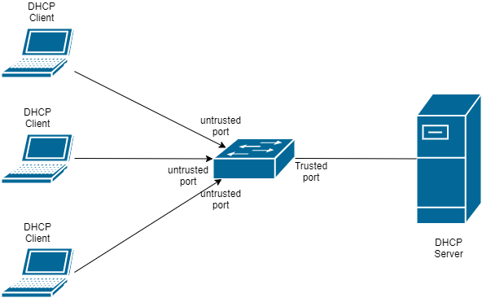
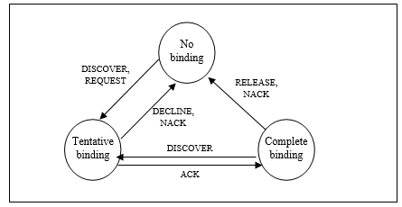
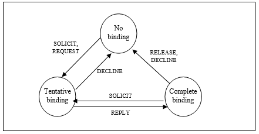
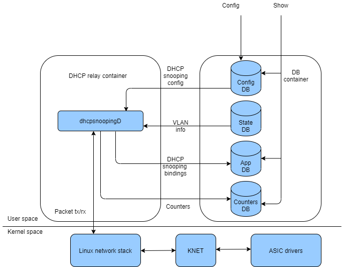
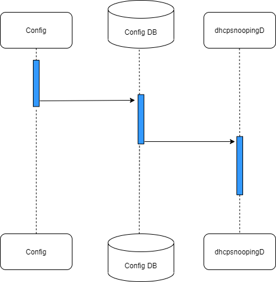
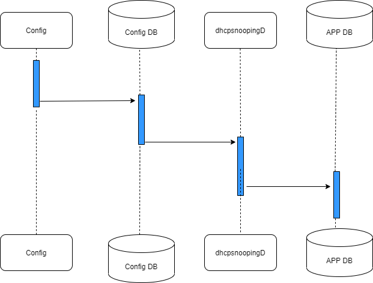
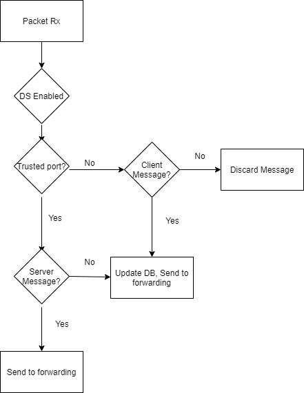

# DHCP snooping

# High Level Design Document
#### Rev 0.2

# Table of Contents
 - [List of Tables](#list-of-tables)
 - [Revision](#revision)
 - [About This Manual](#about-this-manual)
 - [Scope](#scope)
 - [Terminology/abbreviations](#terminology/abbreviations)
 - [1 Requirement Overview](#1-requirement-overview)
    - [1.1 Functional Requirements](#11-functional-requirements)
    - [1.2 Configuration and Management Requirements](#12-configuration-and-management-requirements)
    - [1.3 Scalability Requirements](#13-scalability-requirements)
    - [1.4 Warm Boot Requirements](#14-warm-boot-requirements)  
- [2 Functionality](#2-functionality)
   - [2.1 Target Deployment Use Cases](#21-target-deployment-use-cases)
   - [2.2 Functional Description](#22-functional-description)
- [3 Design](#3-design)
   - [3.1 Overview](#31-overview)
   - [3.2 DB Changes](#32-db-changes)
	   	- [3.2.1 CONFIG DB](#321-config-db)
	   		- [3.2.1.1 DHCP Snooping Admin Mode](#3211-dhcp-snooping-admin-mode)
	   		- [3.2.1.2 DHCP Snooping VLAN Configuration](#3212-dhcp-snooping-vlan-configuration)
	   		- [3.2.1.3 DHCP Snooping DB Configuration](#3213-dhcp-snooping-db-configuration)
	   		- [3.2.1.4 Trust Configuration](#3214-trust-configuration)
		- [3.2.2 STATE DB](#322-state-db)
	- [3.3 COPP](#33-copp)
	- [3.4 Switch State Service Design](#34-switch-state-service-design)
	- [3.5 SyncD](#35-syncd)
	- [3.6 SAI](#36-sai) 
	- [3.7 Configuration](#37-configuration)
		- [3.7.1 CLI](#371-cli)
		- [3.7.2 REST API Support](#372-rest-api-support)
- [4 Flow Diagrams](#4-flow-diagrams)
- [5 Serviceability and Debug](#5-serviceability-and-debug)
- [6 Warm Boot Support](#6-warm-boot-support)
- [7 Scalability](#7-scalability)
- [8 Unit Test](#8-unit-test)
- [9 Internal Design Information](#9internal-design-information)
  

# List of Tables
[Table 1: Abbreviations](#table-1-abbreviations)

# Revision
	
	| Rev |     Date    |       Author       | Change Description                |
	|:---:|:-----------:|:------------------:|-----------------------------------|
	| 0.1 | 02/22/2021  |   Phanindra TV     | Initial version                   |
    | 0.2 | 03/31/2021  |   Ravi Vemuri      | More details added                |
	
# About this Manual
This document provides general information about the support for DHCPv4 snooping and DHCPv6 snooping in SONiC.

# Scope
This document describes the high level design of DHCP snooping feature. 

# Terminology/abbreviations
Trusted port: A port the network administrator does not consider a security threat.

Untrusted port: A port which could potentially be used to launch a network attack.

Bindings database: A set of {MAC address, IP address, interface, vlan} tuples that are sniffed from DHCP packet exchange. Administrator can enter static entries into this table. The bindings database also stores the lease time allotted by the server.

Tentative binding: A binding whose IP address is 0.0.0.0. Tentative bindings are created from DISCOVER and REQUEST messages for DHCPv4 and SOLICIT and REQUEST messages for DHCPv6. Tentative binding entries are moved to Binding database when the client’s IP address is confirmed in a DHCP ACK message from DHCPv4 server and REPLY message from DHCPv6 server.

DHCP client message: A DHCP message originated by a DHCP client with destination UDP port as 68 for DHCPv4 client and 546 for DHCPv6 client messages.

DHCP server message: A DHCP message originated by a DHCP server with 67 as destination UDP port for DHCPv4 server and 547 for DHCPv6 server messages. 

# 1 Requirement Overview

When a rogue device generates multiple DHCP client requests with different MAC addresses it results in the DHCP server getting depleted of all the IPs in its pool. Genuine clients awaiting IP address allotment are denied service. This is called **DHCP starvation attack**. 

When a rogue device acting as a DHCP server manages to reply back to clients' requests ahead of the legitimate  DHCP server's replies, client data traverses the rogue device and it can spoof every frame. This is called **DHCP spoofing attack**.

DHCP snooping mitigates DHCP starvation attacks and DHCP spoofing attacks.

DHCP snooping prevents unauthorized DHCP servers from offering IP addresses to DHCP clients by checking trust state of the port thereby mitigating spoofing attacks. By verifying the client hardware MAC address against the source MAC in the ethernet header minimizes the scope of starvation attacks.

Refer [Configuration commands](#configuration-commands) for corresponding command for each of the listed requirements.

Support for DHCP snooping is added in SONiC 4.0.

The number of snooping binding entries in DHCP DB is limited to 1K. More details are listed in [Scalability](#scalability) section.

Go back to [Beginning of the document](#dhcp-snooping).

## 1.1 Functional Requirements
 
1. Support DHCPv4 snooping and DHCPv6 snooping (works with DHCPv6 stateful server). 'DHCP snooping' as used in this document refers to both DHCPv4 snooping and DHCPv6 snooping.
2. Allow ports to be configured as trusted and untrusted depending on their connectivity towards the servers and the clients respectively. This allows DHCP Snooping to drop DHCP server packets that are received on untrusted ports. 
3. Trust can be enabled on physical interfaces and port-channels.
4. Support for enabling DHCP snooping on a per-VLAN basis
5. Provide configurable options to verify client's hardware MAC address against the source MAC in ethernet header and drop those that mismatch.
6. Maintain DHCP bindings for all the clients that have IP address and lease time allotted by the server.
7. Log invalid DHCP messages.
8. Support for simultaneously enabling both DHCPv4 snooping and DHCPv6 snooping.
9. Support statistics for DHCPv4 and DHCPv6 snooping.
10. DHCP Snooping feature and DHCP L3 Relay feature are mutually exclusive.
 

Go back to [Beginning of the document](#dhcp-snooping).
## 1.2 Configuration and Management Requirements

Configuration and management for DHCP Snooping is supported via the following interfaces:

- REST API interface generated based on OC-YANG model
- KLISH based CLI commands using management framework

List of configuration and display aspects: 

1. Enable DHCP snooping globally.
2. Configure ports connected to DHCP server as trusted.
3. Enable DHCP snooping on a single VLAN or a range of VLANs.
4. For additional security, enable source MAC verification.
5. Configure static DHCP Snooping binding entries.
6. Display bindings database that maintains src MAC, interface, VLAN, IP and lease time.
7. Clear DHCP bindings database.

Go back to [Beginning of the document](#dhcp-snooping).
## 1.3 Scalability Requirements

1. DHCP Snooping feature is qualified to handle upto 1024 clients. 
2. DHCP Snooping feature is qualified to handle 64 static binding entries.   

Go back to [Beginning of the document](#dhcp-snooping).
## 1.4 Warm Boot Requirements
DHCP snooping bindings are retained during warm restart. 

Go back to [Beginning of the document](#dhcp-snooping).
# 2 Functionality
## 2.1 Target Deployment Use Cases

DHCP clients connect through untrusted ports. DHCP messages from clients received on untrusted ports are forwarded to the trusted ports in the same VLAN.

In enterprise and campus networks, the most common denial of service issue encountered is that of an end-user connecting a consumer-grade router at their desk ignorant that the device they plugged in could act as a DHCP server by default. This DHCP server could potentially begin assigning IP addresses to hosts within the network thereby causing network connectivity issues and in many cases, major service disruptions:
 
 - Best case being DHCP clients being assigned an invalid IP address disconnecting them from the rest of the network. 
 - Worst case being DHCP clients been assigned an IP address used by core network infrastructure devices (example:  VLAN interface on the core switch or a firewall interface) causing serious network disruptions and conflicts. 

Go back to [Beginning of the document](#dhcp-snooping).
## 2.2 Functional Description

1.  DHCP Snooping is an access layer security feature that monitors DHCP messages between a DHCP client and DHCP server to filter harmful DHCP messages and to build a bindings database of {MAC address, IP address, VLAN ID, port} tuples that are considered authorized. The network administrator enables DHCP snooping globally and on specific VLANs, and configures ports within the VLAN to be trusted or untrusted.  DHCP servers must be reached through trusted ports. Ports are untrusted, by default.
 
 - Packet Validations: DHCP snooping enforces the following security rules-
 
	•	DHCP packets from a DHCPv4 server (DHCPOFFER, DHCPACK, DHCPNAK, DHCPRELEASEQUERY) and DHCPv6 server (ADVERTISE, REPLY, RECONFIGURE) are dropped if received on an untrusted port.
 
	•	DHCPRELEASE and DHCPDECLINE messages are dropped if the incoming DHCP packet details (MAC address, incoming interface etc) do not match details in the Snooping entry.

	•	On untrusted interfaces, the switch drops DHCP packets whose source MAC address does not match the client hardware address. This feature is a configurable option.

2. DHCPv6 snooping works only with DHCPv6 stateful server.

3. When proper COPP rules for DHCP L2 packets are installed, the DHCP packets are trapped to CPU. The application needs to process the packet if DHCP Snooping is enabled globally and that the port is a member of a VLAN where DHCP Snooping is enabled. 
 
4. The DHCP snooping application processes incoming DHCP messages. For DHCPRELEASE and DHCPDECLINE messages from DHCPv4 client and for RELEASE and DECLINE messages from DHCPv6 client the application compares the receive interface and VLAN with the client’s interface and VLAN in the bindings database. If the interfaces do not match, the application logs the event and drops the message. The message is dropped if it does not match a binding entry.
 
5. For valid client messages, DHCP snooping compares the source MAC address to the DHCP client hardware address. Where there is a mismatch, DHCP snooping logs and drops the packet. The network administrator can disable this feature using **no ip dhcp snooping verify mac-address** for DHCPv4 and **no ip dhcpv6 snooping verify mac-address** for DHCPv6. DHCP snooping forwards valid client messages on trusted members with in the VLAN. 
 
6. The source MAC address of DHCP packet is different from the client hardware in the case of 
	•	DHCP discovery/request broadcast packet that got forwarded by the relay agent and
	•	DHCP unicast request packet that got routed by the router in renew process.

7. In the above cases the source mac verification with the DHCP packet’s client hardware address should be disabled on untrusted ports. Otherwise DHCP packets are dropped in the process of filtering.

8. DHCP snooping application uses DHCP messages to build and maintain the bindings database. **The bindings database only includes data for clients on untrusted ports**. DHCP snooping creates a tentative binding from DHCP DISCOVER for DHCPv4 and SOLICIT for DHCPv6 and REQUEST messages. Tentative bindings tie a client to a port (the port where the DHCP client message was received). Tentative bindings are completed when DHCP snooping learns the client’s IP address from ACK message received from DHCPv4 server and REPLY message received from DHCPv6 server on a trusted port. DHCP snooping removes bindings in response to DECLINE and RELEASE from DHCPv4 client and NACK from a DHCPv4 server. Similarly, for RELEASE and DECLINE from DHCPv6 client and RECONFIGURE message received from a DHCPv6 client, snooping component removes the bindings from the database. DHCP Snooping application ignores the ACK messages sent as a replies to DHCP INFORM messages received on trusted ports from DHCPv4 servers. DHCP snooping application ignores REPLY messages that are sent in response to CONFIRM messages received on trusted ports from DHCPv6 servers.  
 

9. Lease time of the entries is dependent on real time clock (RTC) support. If the absolute lease time of snooping database entry expires then that entry will be removed. Administrator should take care of the system time to be consistent across the reboots. Otherwise snooping entries will not expire properly. Tentative binding entries are removed after 60 seconds if there is no ACK message received from DHCPv4 server or REPLY message received from DHCPv6 server on a trusted port. If a host sends DHCP release while the switch is rebooting, then when the switch receives the DHCP discovery or request, the client’s binding will be marked as tentative binding.

10. DHCP Server messages received on non-trusted ports are dropped. 
 
11. VLANs on which DHCP snooping is enabled cannot be deleted without first disabling DHCP snooping.

Go back to [Beginning of the document](#dhcp-snooping).
# 3 Design
## 3.1 Overview

High level overview:

DHCP snooping functionality is added to the DHCP Relay container. The container will now host the dhcpsnoopingD (DHCP snooping daemon) process.

dhcpsnoopingD process will handle the functionality and has following interactions:

 - register with config DB for receiving DHCP snooping configuration
 - register with state DB for VLAN configuration
 - interacts with Linux kernel for packet tx/rx
 - updates the DHCP snooping binding entries to the APP DB
 - updates counters to the counters DB.

dhcpsnoopingD process will handle following functionality.

1. Handle Configuration 
2. Packet processing

	a. Socket of PF_PACKET type will be created for packet tx/rx

	b. Filters will be attached to the socket to receive DHCP packets based on source and destination UDP port numbers.

	c. PACKET_AUXDATA socket option will be set to get the VLAN id of the packet received from the cmsg headers.

3. Create and maintain binding database entries and update the same to the APP DB.
4. Timers handling - Timer events are generated every 1000ms to validate the pending lease time for DHCP snooping bindings.

Go back to [Beginning of the document](#dhcp-snooping).

## 3.2 DB Changes
 This section describes the changes made to different DBs for supporting DHCP snooping.

### 3.2.1 CONFIG DB
Following config DB schemas are defined for supporting this feature.

#### 3.2.1.1 DHCP Snooping Global Admin mode: DHCP_SNOOPING_GLOBAL_TABLE

    "DHCP_SNOOPING": {
        "GLOBAL": {
            "dhcpv4_admin_enable": "true", 
            "dhcpv4_verify_mac_address": "false",
			"dhcpv6_admin_enable": "true",
			"dhcpv6_verify_mac_address": "false"
        }
    }, 

#### 3.2.1.2 DHCP Snooping VLAN Configuration:

The following will be added to the VLAN DB.

	VLAN|{{vlan}}
		"dhcpv4_snooping_enable": {{true|false}},
		"dhcpv6_snooping_enable": {{true|false}}

For example, 

	"VLAN": {
        "Vlan10": {
            "dhcpv4_snooping_enable": "true",
			"dhcpv6_snooping_enable": "true",
            "members": [
                "Ethernet8"
            ],
            "vlanid": "10"
        },
    }
		
#### 3.2.1.3 DHCP Snooping DB Configuration: DHCP_SNOOPING_STATIC_BINDING_GLOBAL_TABLE

	;Stores user configured static DHCP bindings 
	;Status: work in progress
	key             = DHCP_SNOOPING_STATIC_BINDING|GLOBAL	; Global DHCP snooping static binding table key
	mac				= mac-address							; client hardware address
	vlan			= vlan-id								; DHCP snooping enabled vlan
	intf			= interface								; front panel physical port or port channel
	ipaddress		= ipv4 address / ipv6 address			; ipv4/ipv6 address

#### 3.2.1.4 Trust Configuration

DHCP Snooping per interface trust configuration will be added to the existing PORT and PORTCHANNEL config structure.
 
	PORT|{{ethernet-name}} 
		"dhcpv4_snooping_trust": {{true|false}},
		"dhcpv6_snooping_trust": {{true|false}}
	
	PORTCHANNEL|{{portchannel-name}}
		"dhcpv4_snooping_trust": {{true|false}},
		"dhcpv6_snooping_trust": {{true|false}}

For example,

    "PORT": {
       "Ethernet81": {
			"dhcpv4_snooping_trust": "true",
			"dhcpv6_snooping_trust": "false"
        }
    }, 
    "PORTCHANNEL": {
        "PortChannel1": {
			"dhcpv4_snooping_trust": "true",
			"dhcpv6_snooping_trust": "true"
        }, 
    }, 

### 3.2.2 APP DB

DHCP_SNOOPING_BINDING_GLOBAL_TABLE

	;Stores dynamic DHCP bindings 
	;Status: work in progress
	key             = DHCP_SNOOPING_BINDING|GLOBAL			; Global DHCP snooping binding table key
	mac				= mac-address							; client hardware address
	vlan			= vlan-id								; DHCP snooping enabled vlan
	intf			= interface								; front panel physical port or port channel
	ipaddress		= ipv4 address / ipv6 address			; ipv4/ipv6 address
	lease_time		= time in seconds						; time allotted by DHCP server, NA for static entry
	type 			= "static"/"dynamic"					; static or dynamic

### 3.2.3 Counters DB

#### 3.2.3.1 DHCP Snooping Counters DB

Counters will be added to capture statistics. Rest of the section is TBD. 

## 3.3 COPP

The following KLISH commands install DHCP L2 Copp rule for DHCP Snooping. These rules are not installed by default. The administrator has to remove the DHCP L3 COPP rule and install the DHCP L2 COPP rule for DHCP Snooping to work (The L2 version of the DHCP COPP policy does not match on L3 classifier). These policies are system wide policies and not per-port. 

	/*KLISH command to uninstall DHCP L3 Copp rules. These rules are installed by default*/
	sonic# configure terminal
	sonic(config)# policy-map copp-system-policy type copp
	sonic(config-policy-map)# no class copp-system-dhcp

	/* KLISH command to install DHCP L2 Copp rule for DHCP snooping. Not installed by default */
	sonic# configure terminal
	sonic(config)# policy-map copp-system-policy type copp
	sonic(config-policy-map)# class copp-system-dhcpl2
	sonic(config-policy-map-flow)# set copp-action copp-system-dhcp

To revert the system to the default state, uninstall the DHCP L2 Copp rule and install the DHCP L3 Copp rule.

	/*KLISH command to uninstall DHCP L2 Copp rule*/
	sonic# configure terminal
	sonic(config)# policy-map copp-system-policy type copp
	sonic(config-policy-map)# no class copp-system-dhcpl2

	/* KLISH command to install DHCP L3 Copp rule. */
	sonic# configure terminal
	sonic(config)# policy-map copp-system-policy type copp
	sonic(config-policy-map)# class copp-system-dhcp
	sonic(config-policy-map-flow)# set copp-action copp-system-dhcp
	
## 3.4 Switch State Service Design
Not applicable.

## 3.5 SyncD	
Not applicable.

## 3.6 SAI
Not applicable.

## 3.7 Configuration 

Default Settings for DHCP Snooping (applies to DHCPv4 and DHCPv6): 

	DHCP snooping global mode              : Disabled
	DHCP snooping VLAN                     : None
	DHCP snooping MAC address verification : Enabled
	DHCP snooping trust                    : Untrusted

DHCP Snooping does not have an openconfig YANG model so a custom SONIC YANG will be supported.

### 3.7.1 SONiC CLI (KLISH)

#### 3.7.1.1 Configuration commands

Following KLISH based CLI configuration commands configure DHCP Snooping

##### 3.7.1.1.1 Enable DHCP Snooping globally
This command is executed in config mode.

	To enable/disable DHCPv4 Snooping globally. 
	sonic(config)#[no] ip dhcp snooping

	To enable/disable DHCPv6 snooping globally
	sonic(config)#[no] ipv6 dhcp snooping
 
##### 3.7.1.1.2 Enable DHCP Snooping on a VLAN list
This command is executed in config mode.

	To enable/disable DHCPv4 Snooping on a VLAN list
	sonic(config)#[no] ip dhcp snooping vlan <*vlan-list*>

	To enable DHCPv6 snooping on a VLAN list
	sonic(config)#[no] ipv6 dhcp snooping vlan <*vlan-list*>

##### 3.7.1.1.3 Enable DHCP Snooping MAC address verification
This command is executed in config mode.

	To enable/disable DHCPv4 snooping MAC address verification
	sonic(config)#[no] ip dhcp snooping verify mac-address

	To enable/disable DHCPv6 snooping MAC address verification
	sonic(config)#[no] ipv6 dhcp snooping verify mac-address

##### 3.7.1.1.4 Create a static source address to a Layer 2 interface
This command is executed in config mode.

	To bind a static IPv4 address to a Layer 2 interface
	sonic(config)#[no] ip source binding *IP-address* *MAC-address* vlan *vlan-id* {interface <interface name>}
    To clear all IP DHCP Snooping binding entries 
	sonic(config)# clear ip dhcp snooping binding

	To bind a static IPv6 address to a Layer 2 interface
	sonic(config)#[no] ipv6 source binding *IP-address* *MAC-address* vlan *vlan-id* {interface <interface name>}
    To clear all IPv6 DHCP Snooping binding entries 
	sonic(config)# clear ipv6 dhcp snooping binding

##### 3.7.1.1.5 Configure an interface as trusted
This command is executed in interface mode.

	To configure/unconfigure trust for an interface for DHCPv4 Snooping
	sonic(config-if)#[no] ip dhcp snooping trust

	To configure/unconfigure trust for an interface for DHCPv6 snooping
	sonic(config-if)#[no] ipv6 dhcp snooping trust

##### 3.7.1.1.6 Show commands

	To display general information about DHCP Snooping
	sonic# show ip dhcp snooping

	To display the DHCP Snooping binding database
	sonic# show ip dhcp snooping binding

	To display general information about DHCPv6 Snooping
	sonic# show ipv6 dhcp snooping

	To display the DHCPv6 Snooping binding database
	sonic# show ipv6 dhcp snooping binding

For example,

	console#show ip dhcp snooping

	DHCP snooping is Enabled
	DHCP snooping source MAC verification is disabled
	DHCP snooping is enabled on the following VLANs: 10,20

	Interface   Trusted 
	----------- ----------
	Ethernet0   No
	Ethernet1   Yes
	Ethernet2   No
	...

	(Config)#show ip dhcp snooping binding 

	Total number of bindings:  2
	Total number of Tentative bindings:  0

   	MAC Address        IP Address       VLAN   Interface    Type     Lease (Secs)
	-----------------  ---------------  ----   -----------  -------  -----------
	00:00:00:00:00:01  1.1.1.1          10     Ethernet0    STATIC   - 
	00:00:A8:5F:34:52  192.168.10.39    20     Ethernet2    DYNAMIC  86396

### 3.7.2 REST API Support

TBD

Go back to [Beginning of the document](#dhcp-snooping).
# 4 Flow Diagrams
## Configuration

The following configuration flows to ConfigDB, which then notifies the dhcpsnoopingD process.

	DHCP Snooping Global Admin Status
	DHCP Snooping MAC Address Verification
	DHCP Snooping VLAN information
	DHCP Snooping Interface Trust mode

## DHCP Snooping Static Bindings Configuration

A Static Bindings entry configuration is written to the APP DB by the dhcpsnoopingD

Go back to [Beginning of the document](#dhcp-snooping).
# 5 Serviceability and Debug
- Processing errors will be logged in syslog with ERROR level.

Go back to [Beginning of the document](#dhcp-snooping).
# 6 Warm Boot Support
The DHCP Snooping binding DB is updated to the APP_DB. Post a warm boot, this table is read back by dhcpsnoopingD. Any tentative entries that are created before the warm boot phase is initiated are lost. DHCP packets exchanged during the warm boot phase are dropped and the client has to re-initiate a DHCP session again post the warm boot phase is complete. 

Go back to [Beginning of the document](#dhcp-snooping).
# 7 Scalability

DHCP Snoopoing feature allows 64 Static entries to be configured. A total of 1K clients are supported. Beyond 1K clients, the DHCP Snooping DB is not updated and the DHCP packets are dropped.

Go back to [Beginning of the document](#dhcp-snooping).
# 8 Unit Test

##8.1 CLI Test cases

1. Verify CLI to enable DHCPv4 Snooping globally
2. Verify CLI to enable DHCPv4 Snooping per VLAN
3. Verify CLI to enable DHCPv4 Snooping per group of VLANs
4. Verify CLI to enable DHCPv4 Snooping Mac Verification
5. Verify CLI to configure a static DHCPv4 Snooping entry
6. Verify CLI to enable DHCPv6 Snooping globally
7. Verify CLI to enable DHCPv6 Snooping per VLAN
8. Verify CLI to enable DHCPv6 Snooping per group of VLANs
9. Verify CLI to enable DHCPv6 Snooping Mac Verification
10. Verify CLi to configure a static DHCPv6 Snooping entry
11. Verify configuration is retained after save and reload.
12. Verify CLI to clear all dynamic DHCP Snooping entries
13. Verify CLI to delete one dynamic DHCP Snooping entry.
14. Verify CLI to disable DHCPv4 Snooping globally
15. Verify CLI to disable DHCPv4 Snooping per VLAN
16. Verify CLI to disable DHCPv4 Snooping Mac Verification
17. Verify CLI to disable DHCPv6 Snooping globally
18. Verify CLI to disable DHCPv6 Snooping per VLAN
19. Verify CLI to disable DHCPv6 Snooping Mac Verification
20. Verify CLI to configured trust mode for DHCPv4 an interface as trusted
21. Verify CLI to configured trust mode for DHCPv6 an interface as trusted.
22. Verify CLI to configure trust mode for DHCPv4 an interface as untrusted.
23. Verify CLI to configure trust mode for DHCPv6 an interface as untrusted.
24. Verify if DHCP Snooping can be enabled for maximum number of VLANs supported on the DUT.
25. Verify if maximum number of static snooping entries are configurable
26. Verify if maximum number of dynamic snooping entries can be cleared.
27. On bootup and with no additional DHCP snooping configuration, verify all DHCP configuration are as per defaults. 
28. After configuring various DHCP Snooping configuration commands, verify that the show command reflects the DHCP snooping configuration. 
29. Verify CLI to display DHCP Snooping binding entries
30. Verify CLI to enable debug logs for DHCP Snooping
31. Verify CLI to enable DHCP Snooping debug logs per VLAN
32. Verify CLI to enable DHCP Snooping debug logs per interface

##8.2 Functionality test cases

1. Verify that DHCP functionality is not impacted if DHCP Snooping is not enabled globally.
2. Verify that once DHCP Snooping functionality is enabled globally, the DHCP messages received in VLANs that are not enabled for snooping are discarded.
3. Verify that once a VLAN is enabled for Snooping, DHCP packets from clients received on untrusted ports go out only on trusted ports
4. Verify that a DHCPv4 tentative binding entry is created when A DHCPDISCOVER message is received.
5. Verify that a DHCPv4 tentative binding entry is removed after 60 seconds when no ACK message is received from the server.
6. Verify that a DHCPv6 tentative binding entry is created when a SOLICIT  message is received.
7. Verify that a DHCPv6 tentative binding entry is removed after 60 seconds when no REPLY message is received from the server.
8. Verify that a legitimate client connected to an untrusted port gets an IP from the DHCP Server. Verify that a dynamic DHCP Snooping binding is created at the DUT.
9. Verify that the lease time for a snooping entry decrements gradually.
10. Verify that DHCPOFFER packets received on an untrusted port is dropped.
11. Verify that DHCPACK packets received on an untrusted port is dropped.
12. Verify that DHCPNAK packets received on an untrusted port is dropped.
13. Verify that ADVERTISE packets received on an untrusted port is dropped.
14. Verify that REPLY packets received on an untrusted port is dropped.
15. Verify that RECONFIGURE packets received on an untrusted port is dropped.
16. Verify that DHCPRELEASE packet is dropped when the packet details do not match with an existing Snooping entry. Verify a log is generated in this case.
17. Verify that DHCPDECLINE packet is dropped when the packet details do not match with an existing Snooping entry. Verify a log is generated in this case.
18. Verify that DECLINE packet is dropped when the packet details do not match with an existing Snooping entry. Verify a log is generated in this case.
19. Verify that RELEASE packet is dropped when the packet details do not match with an existing Snooping entry. Verify a log is generated in this case. 
20. Configure 'mac verification' and verify that DHCPv4 packets whose source MAC address that do not match the clients hardware address are dropped.
21. Configure 'mac verification' and verify that DHCPv6 packets whose source MAC address that do not match the clients hardware address are dropped.
22. Unconfigure 'mac verification' and verify that DHCP packets whose source MAC address do no match the clients hardware address are not dropped and properly forwarded.
23. Verify if maximum number of dynamic binding entries can be created.
24. Verify that snooping binding entries are removed after the lease expires. 
25. Verify that a snooping binding entry is removed after a valid DHCPRELEASE packet is received.
26. Verify that a snooping binding entry is removed after a valid DHCPDECLINE packet is received.
27. Verify that a snooping binding entry is removed after a valid DECLINE packet is received.
28. Verify that a snooping binding entry is removed after a valid RELEASE packet is received.
29. Verify that the VLAN on which DHCP snooping is enabled, cannot be deleted.
30. Verify that trust/untrust configuration on a port is retained after a port shut/no-shut operation.
31. Verify that a port can be set to 'trust' only if the VLAN to which it belongs has DHCP snooping enabled.

Go back to [Beginning of the document](#dhcp-snooping).
# 9 Internal Design Information

Go back to [Beginning of the document](#dhcp-snooping).
