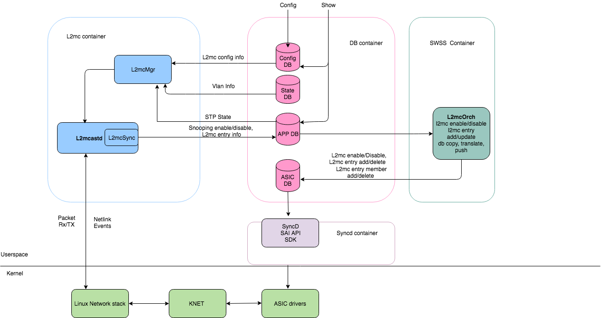
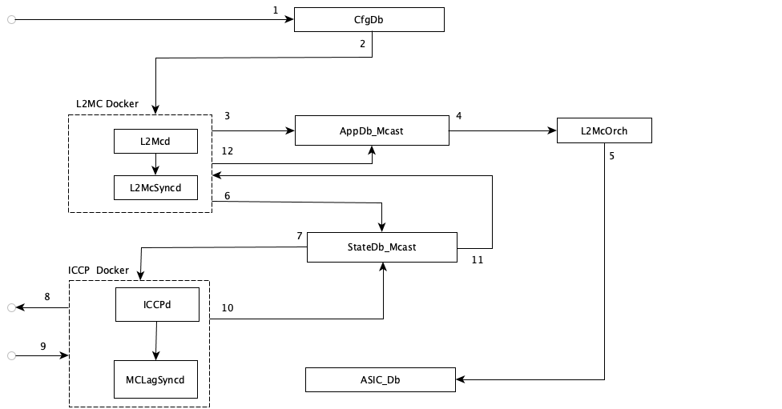
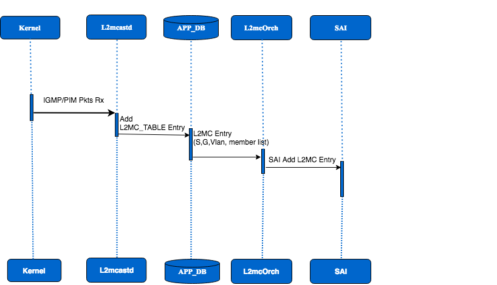
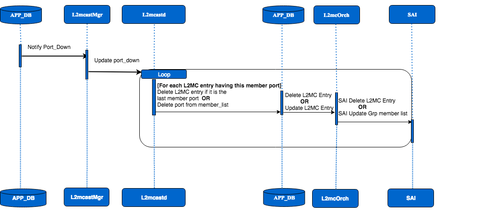
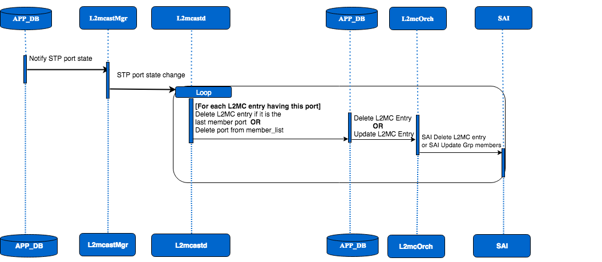

# SONiC IGMP Snooping
# High Level Design Document
#### Rev 0.2

# Table of Contents
  * [List of Tables](#list-of-tables)
  * [Revision](#revision)
  * [About This Manual](#about-this-manual)
  * [Scope](#scope)
  * [Definition/Abbreviation](#definitionabbreviation)
  * [1 Feature Overview](#feature-overview)
     * [1.1 Requirements](#requirements)
        *  [1.1.1 Functional Requirements](#functional-requirements)
        *  [1.1.2 Configuration and Management Requirements](#configuration-and-management-requirements)
        *  [1.1.3 Scalability Requirements](#scalability-requirements)
        *  [1.1.4 Warm Boot Requirements](#warm-boot-requirements)
      *  [1.2 Design Overview](#design-overview)
          * [1.2.1 Basic Approach](#basic-approach)
          * [1.2.2 L2MC Docker](#l2mc-docker)
          * [1.2.3 SAI Overview](#sai-overview)
          * [1.2.4 MLAG Support](#mlag-overview)
  * [2 Functionality](#-functionality)
      * [2.1 Target Deployment Use Cases](#target-deployment-use-cases)
      * [2.2 Functional Description](#functional-description)
  * [3 Design](#design)
      * [3.1 Overview](#overview)
      * [3.2 DB Changes](#db-changes)
          * [3.2.1 CONFIG DB](#config-db)
          * [3.2.2 APP DB](#app-db)
          * [3.2.3 STATE_DB](#state-db)
      * [3.3 Switch State Service Design](#switch-state-service-design)
          * [3.3.1 L2mcOrch changes](#l2mcorch-changes)
      * [3.4 Docker for L2MC](#docker-for-l2mc)
      * [3.4 SAI](#sai)
      * [3.6 CLI](#cli)
          * [3.6.1 Data Models](#data-models)
          * [3.6.2 Configuration Commands](#configuration-commands)
          * [3.6.3 Show Commands](#show-commands)
          * [3.6.4 Debug Commands](#debug-commands)
          * [3.6.5 Rest API Support](#rest-api-support)
      * [3.7 MCLAG For IGMP Snooping](#mclag-for-igmp-snooping)
  * [4 Flow Diagrams](#flow-diagrams)
	  * [4.1 IGMP Snooping Enable on VLAN](#igmp-snooping-enable-on-vlan)
	  * [4.2 Static L2MC add flow](#static-l2mc-add-flow)
	  * [4.3 Dynamic L2mc add flow](#dynamic-l2mc-add-flow)
	  * [4.4 Port Down flow](#port-down-flow)
	  * [4.5 Vlan member-port delete flow](#vlan-member-port-delete-flow)
	  * [4.6 STP State change flow](#stp-state-change-flow)
  * [5 Error Handling](#error-handling)
  * [6 Serviceability and Debug](#serviceability-and-debug)
  * [7 Warm Boot Support](#warm-boot-support)
  * [8 Scalability](#scalability)
  * [9 Unit Test](#unit-test) 
     * [9.1 CLI Test Cases](#cli-test-cases)
     * [9.2 Rest API Test Cases](#rest-api-test-cases)
     * [9.3 Functional Test Cases](#functional-test-cases)
     * [9.4 IGMPv1 V2 and V3 cases](#igmpv1-v2-and-v3-cases)
     * [9.5 Warm Boot Test Cases](#warm-boot-test-cases)
     * [9.6 Scalability Test Cases](#scalability-test-cases)
     * [9.7 Negative Test Cases](#negative-test-cases)

# List of Tables
[Table 1: Abbreviations](#table-1-abbreviations)

# Revision
| Rev |     Date    |       Author       | Change Description                |
|:---:|:-----------:|:------------------:|-----------------------------------|
| 0.1 | 05/22/2019  |  Ashok Krishnegowda| Initial version                   |
| 0.2 | 06/25/2091  |  Ashok Krishnegowda| Incorporated review comments      |
| 0.3 | 20/09/2019  | Benzeer Bava       | MCLAG Support                      |


# About this Manual
This document provides general information about IGMP Snooping feature implementation in SONiC.
# Scope
This document describes the functionality and high level design of IGMP Snooping feature in SONiC. 


# Definition/Abbreviation
### Table 1: Abbreviations
| Term   | Meaning                                                |
|--------|--------------------------------------------------------|
| IGMP   | Internet Group Management Protocol            		  |
| PIM    | Protocol Independent Multicast						  |
| L2MC	 | Layer-2 Multicast									  |
|Mrouter | Multicast router										  |
|MCLAG    | Multi-Chassis Link Aggregation Group                   |

# 1 Feature Overview
The forwarding of multicast control packets and data through a Layer 2 device configured with VLANs is most easily achieved by the Layer 2 forwarding of received multicast packets on all the member ports of the VLAN interfaces. However, this simple approach is not bandwidth efficient, because only a subset of member ports may be connected to devices interested in receiving those multicast packets. In a worst-case scenario, the data would get forwarded to all port members of a VLAN with a large number of member ports, even if only a single VLAN member is interested in receiving the data. Such scenarios can lead to loss of throughput for a device that gets hit by a high rate of multicast data traffic.
Internet Group Management Protocol (IGMP) snooping is a mechanism by which a Layer 2 device can effectively address this issue of inefficient multicast forwarding to VLAN port members. Snooping involves "learning" forwarding states for multicast data traffic on VLAN port members from the IGMP control (join/leave) packets received on them.
When snooping is enabled on a VLAN, switch examines IGMP packets between hosts connected to network switches and multicast routers. Switch builds member list based on what it learns from the report and mrouter port based on IGMP queries or PIM hello packet from multicast router, the switch then forwards multicast traffic to those interfaces in the VLAN where interested receivers are present instead of flooding the traffic to all member ports of the VLAN.


## 1.1 Requirements

### 1.1.1 Functional Requirements
 1. Support IGMP Snooping for IGMP Version1 (IGMPv1), IGMPv2, IGMPv3.
 2. Support IPv4 based forwarding.
 3. Support IGMP fast leave.
 4. Support IGMP querier functionality.
 5. Support static and dynamic multicast router list. 
 6. Aging of dynamic mrouter ports will be supported. Static mrouter ports will not timed out, they have to be un-configured explicitly.
 7. Support static multicast group configuration. Static l2mc entries will not timed out, they have to be un-configured explicitly.
 8. Support trapping IGMP and PIM Hello control packets to CPU.
 9. Support Link-layer topology changes (due to STP) and generate queries on all non-mrouter ports for faster convergence.
 10.Ability to enable the logging at different levels of the l2mcast module.
 11.Support IGMP Snooping for MCLAG
 

### 1.1.2 Configuration and Management Requirements

This feature will support CLI configurations with the new framework.
 1. Support CLI configurations as described in "Configuration Commands" section below
 2. Support show commands as described in "Show Commands" section below
 3. Support debug commands as described in "Debug Commands" section below
 4. Support openconfig REST API and gNMI

### 1.1.3 Scalability Requirements

SONiC IGMP Snoooping feature does not have scale limit, scale number varies based on ASIC supported number.

The following L2MC entries scale will be tested to success on an ASIC with 512 L2MC group support,
 1. Snooping on maximum of 512 VLANs.
 2. Maximum of 512 L2MC entries.
 
### 1.1.4 Warm Boot Requirements

Dynamic and Static L2MC entries should persist across warm reboot with no traffic disruption to the active flows.
Learning of new snooping entries and aging of existing L2MC entries will stop while the control plane is away.

- To support planned system warm boot.
- To support SWSS docker warm boot.
- To support l2mc docker warm boot.

## 1.2 Design Overview

### 1.2.1 Basic Approach
### 1.2.2  L2MC Docker
A new L2mc docker will be created to support IGMP snooping.
L2mc will host l2mcastMgr and l2mcastd,  and l2mcastSync will be part of l2mcastd, the details of the changes will be discussed in the design section below.  

### 1.2.3 SAI Overview
The existing L2MC SAI interface APIs shall be used to support this feature and they are available at below location,  
[https://github.com/opencomputeproject/SAI/blob/master/inc/sail2mc.h](https://github.com/opencomputeproject/SAI/blob/master/inc/sail2mc.h)  
https://github.com/opencomputeproject/SAI/blob/master/inc/sail2mcgroup.h

The detail of the changes will be discussed in the design section below.

### 1.2.4 MCLAG Overview
In an MCLAG Enabled node, IGMP Source can be at MCLAG member port or Orphan Port. Details of IGMP changes will be discussed at design section below.

# 2 Functionality
Refer to section 1
## 2.1 Target Deployment Use Cases

## 2.2 Functional Description
Refer to section 1.1

# 3 Design
## 3.1 Overview




__Figure 1: IGMP Snooping High Level Architecture__

L2MC docker will host L2mcastMgr and L2mcastd process.

L2mcastMgr process will handle following interactions,

-   L2mcastMgr subscribes to CONFIG_DB to get configuration changes, it gets VLAN info from STATE_DB, and STP state changes from APP_DB.
-   L2mcastMgr notifies all these DB updates to L2mcastd for protocol operation via unix domain socket.

L2mcastd process will handle following interactions,

-   Linux kernel to processes dynamic IGMP and PIM hello packets and netlink events.
-   L2mcastd uses libevent for processing below incoming events from l2mcastMgr,  
    - CLI configurations  
    - STP state change  
    - VLAN configuration changes.
-   Timer events are generated every 100ms for handling IGMP protocol timers.
-   L2mcastSync is part of L2mcastd which handles L2MC entries update to APP_DB to be consumed by L2mcOrch.


## 3.2 DB Changes
This section describes the changes made to different DBs for supporting IGMP Snooping.

### 3.2.1 CONFIG DB
#### CFG_L2MC_TABLE
	
    ;Store IGMP Snooping configuration per VLAN
    ;Status: work in progress
    key                         = CFG_L2MC_TABLE:"Vlan"vlanid
    ;field                      = value
    enabled                     = BIT                       ; Is the IGMP Snooping on VLAN enabled (1) or disabled (0)
    querier                     = BIT                       ; Is the IGMP Snooping querier enabled (1) or disabled (0)
    fast-leave                  = BIT                       ; Is IGMP fast leave enabled(1) or disabled (0)
    version                     = 1*DIGIT                   ; IGMP Snooping Version ( Version 1 or 2 or 3, Default: 2)
    query-interval              = 5*DIGIT                   ; Query Interval Value (1 to 18000sec, Default:125sec)
    last-member-query-interval  = 5*DIGIT                   ; Last Member Query Interval Value (100 to 25500ms; Default: 1000ms)
    query-max-response-time     = 2*DIGIT                   ; Query Response Time (1 to 25sec, Default: 10sec)
    mrouter                     = [0-max_ports]*port_name   ; Multicast router ports
     
     
#### CFG_L2MC_STATIC_TABLE
    ;Store Static L2MC entry configuration per VLAN. 
    ;Status: work in progress 
    key                 = CFG_L2MC_STATIC_TABLE:"vlan"vlanid:source_address:group_address
    ;field              = value
    member_ports        = [0-max_ports]*port_name   ; Multicast Group Member Ports.	
 
### 3.2.2 APP DB

#### APP_L2MC_VLAN_TABLE
	;Store Snooping state on VLAN
    ;Status: work in progress
    key         = APP_L2MC_VLAN_TABLE:"Vlan"vlanid
    ;field      = value

#### APP_L2MC_ENTRY_TABLE
    ;Store L2MC entry per VLAN.
    ;Status: work in progress
    key            = APP_L2MC_ENTRY_TABLE:"Vlan"vlanid:source_address:group_address
    ;field         = value
    type           = "static"/"dynamic"           ; Static or Dynamic multicast group entry
    member_ports   = [0-max_ports]*port_name      ; Multicast group member ports.

### 3.2.3 STATE DB
    
    No changes

### 3.2.4 ASIC DB
### 3.2.5 COUNTER DB

    No changes

## 3.3 Switch State Service Design
### 3.3.1 L2mcOrch changes 
L2mcOrch is responsible for the following activities:
   - Handles snooping enable/disable on VLAN being subscriber to APP_DB. 
   - For l2mc entry table changes, handles creation/deletion of l2mc entry being subscriber to APP_DB.
   - For already existing l2mc entry, updates l2mc entry with changed member list. 
   - Translates these updates to SAI objects and pushes them to ASIC_DB. 
   - Creates l2mc db entry with OID mapping to handle subsequent l2mc entry member addition or deletion.

## 3.4 Docker for L2MC
A separate docker named 'l2mc' is created, It can be stopped/started/restarted independently. By default L2MC docker service will be disabled. When l2mcast docker is stopped, all the static and dynamic learnt l2mc entries are removed from the APP_DB and ultimately from the hardware.

```
root@sonic:/home/admin# docker ps
CONTAINER ID        IMAGE                             COMMAND                  CREATED              STATUS              PORTS               NAMES
9ff843cc79fa        docker-syncd-brcm:latest          "/usr/bin/supervisord"   About a minute ago   Up About a minute                       syncd
042faedb7b4b        docker-dhcp-relay:latest          "/usr/bin/docker_iniâ¦"  About a minute ago   Up About a minute                       dhcp_relay
210f0ad0b776        docker-router-advertiser:latest   "/usr/bin/supervisord"   About a minute ago   Up About a minute                       radv
b45498e6e705        docker-orchagent-brcm:latest      "/usr/bin/supervisord"   About a minute ago   Up About a minute                       swss
a77dbe67649a        docker-l2mc:latest                "/usr/bin/supervisord"   2 minutes ago        Up About a minute                       l2mc
0d3b86e300f9        docker-lldp-sv2:latest            "/usr/bin/supervisord"   2 minutes ago        Up About a minute                       lldp
f65865e90fd1        docker-platform-monitor:latest    "/usr/bin/supervisord"   2 minutes ago        Up About a minute                       pmon
4374ebb6e0e1        docker-teamd:latest               "/usr/bin/supervisord"   2 minutes ago        Up About a minute                       teamd
6244613730fb        docker-fpm-frr:latest             "/bin/sh -c '/usr/biâ¦"  2 minutes ago        Up About a minute                       bgp
9ba9d3e63426        docker-database:latest            "/usr/bin/supervisord"   2 minutes ago        Up 2 minutes                            database
```

## 3.5 SAI
L2MC SAI interface APIs are already defined, table shown below represents the SAI attributes which shall be used for IGMP Snooping.

###### Table 2: L2MC  SAI attributes
| L2MC component		   | SAI attributes                                         |						   
|--------------------------|-------------------------------------------------------|
| VLAN					   | SAI_VLAN_ATTR_CUSTOM_IGMP_SNOOPING_ENABLE <br>
| L2MC ENTRY               | SAI_L2MC_ENTRY_ATTR_OUTPUT_GROUP_ID <br>              
| L2MC Group               | SAI_L2MC_GROUP_ATTR_L2MC_OUTPUT_COUNT <br> SAI_L2MC_GROUP_ATTR_L2MC_MEMBER_LIST <br>
| L2MC Group Member        | SAI_L2MC_GROUP_MEMBER_ATTR_L2MC_GROUP_ID <br> SAI_L2MC_GROUP_MEMBER_ATTR_L2MC_OUTPUT_ID <br>
| L2MC Traps			   | SAI_HOSTIF_TRAP_TYPE_IGMP_TYPE_QUERY <br>SAI_HOSTIF_TRAP_TYPE_IGMP_TYPE_LEAVE<br> SAI_HOSTIF_TRAP_TYPE_IGMP_TYPE_V1_REPORT <br> SAI_HOSTIF_TRAP_TYPE_IGMP_TYPE_V2_REPORT <br> SAI_HOSTIF_TRAP_TYPE_IGMP_TYPE_V3_REPORT <br> SAI_HOSTIF_TRAP_TYPE_PIM <br>


IGMP Snooping feature can be enabled/disabled at VLAN level. By default the IGMP Snooping feature is disabled in SONiC. SAI_VLAN_ATTR_CUSTOM_IGMP_SNOOPING_ENABLE attribute can be set in the VLAN attributes using  **set_vlan_attribute**  

The L2MC traps are enabled on the host interfaces to trap IGMP and PIM control packets to the CPU.

To support programming of l2mc entry with list of member ports, current SAI object model of l2mc allows programming multiple member ports for a given L2MC entry, this is achieved using L2mc group object (SAI_L2MC_ENTRY_ATTR_OUTPUT_GROUP_ID) on the L2MC entry.
L2mc group then has list of L2mc group members each of which points to a member port.

### 3.5.1 COPP_TABLE TRAPS

We have below set of IGMP and PIM traps already defined, 

    {"igmp_query", SAI_HOSTIF_TRAP_TYPE_IGMP_TYPE_QUERY},
    {"igmp_leave", SAI_HOSTIF_TRAP_TYPE_IGMP_TYPE_LEAVE},
    {"igmp_v1_report", SAI_HOSTIF_TRAP_TYPE_IGMP_TYPE_V1_REPORT},
    {"igmp_v2_report", SAI_HOSTIF_TRAP_TYPE_IGMP_TYPE_V2_REPORT},
    {"igmp_v3_report", SAI_HOSTIF_TRAP_TYPE_IGMP_TYPE_V3_REPORT},
    {"pim", SAI_HOSTIF_TRAP_TYPE_PIM},


IGMP and PIM protocol trap support will be added to enable trapping of IGMP query/leave/ v1,v2,v3 reports and PIM control packets.

	"COPP_TABLE:trap.group.igmp”: {
	            "trap_ids": “igmp_query, igmp_leave, igmp_v1_report, igmp_v2_report, igmp_v3_report”,
	            "trap_action":"trap",
	            "trap_priority":"4",
	            "queue": "4",
	            "meter_type":"packets",
	            "mode":"sr_tcm",
	            "cir":"600",
	            "cbs":"600",
	            "red_action":"drop"
	        }

	"COPP_TABLE:trap.group.pim”: {
		            "trap_ids": “pim”,
		            "trap_action":"trap",
		            "trap_priority":"4",
		            "queue": "4",
		            "meter_type":"packets",
		            "mode":"sr_tcm",
		            "cir":"600",
		            "cbs":"600",
		            "red_action":"drop"
		        }

## 3.6 CLI
### 3.6.1 Data Models
Openconfig Yang model will be introduced for this feature.

https://github.com/openconfig/public/blob/master/release/models/multicast/openconfig-igmp.yang

### 3.6.2 Configuration Commands

#### 3.6.2.1 Enable IGMP Snooping on VLAN

**switch# config terminal**

**switch(config)# vlan vlan-id**

This command allows to configure IGMP Snooping on VLAN.

**switch(config-vlan)# ip igmp snooping**


#### 3.6.2.2 Enable IGMP Snooping Querier on VLAN
The IGMP snooping querier sends out IGMP queries to trigger IGMP responses from devices receiving IP multicast traffic. The IGMP snooping querier listens for these responses to map the appropriate forwarding addresses.

Below configuration allows to configure IGMP Snooping querier on VLAN.

**switch(config-vlan)# ip igmp snooping querier**

#### 3.6.2.3 Enable fast-leave 

**switch(config-vlan)# ip igmp snooping fast-leave**

#### 3.6.2.4 Configure query-interval 
This command allows modification of the query interval to specify how often the querier sends general queries. The valid range is from 1 through 18000 seconds. The default is 125 seconds.

**switch(config-vlan)# ip igmp snooping query-interval <query-interval\>**

#### 3.6.2.5 Configure last member query interval
When the querier receives an IGMP leave message, it verifies the multicast group has no remaining listeners by sending a set of group-specific queries at a configured interval. If the querier does not receive a response to the queries, it removes the group state and stops forwarding multicast traffic. 
This command configures the transmission interval for sending group-specific or group-source-specific query messages to the active interface. 
The valid range is from 100 to 25500ms. The default is 1000ms.

**switch(config-vlan)# ip igmp snooping last-member-query-interval <last-member-query-interval\>**

#### 3.6.2.5 Configure max response interval
The Max Response interval field in a membership query messages specifies the longest time a host can wait before responding with a membership report message.
Use the following commands to set the maximum response time and Value range from 1 to 25 seconds. The default is 10 seconds.

**switch(config-vlan)# ip igmp snooping query-max-response-time <query-max-response-time\>**

#### 3.6.2.6 Configure IGMP version

This command allows to configure  IGMP versions 1 through 3. A VLAN that is configured with IGMP snooping uses default version 2 (unless otherwise configured). 

**switch(config-vlan)# ip igmp snooping version <version\>**

#### 3.6.2.7 Configure static multicast router(mrouter) port
This command allows to configure static mrouter ports

**switch(config-vlan)# ip igmp snooping mrouter interface <interface-name\>**

#### 3.6.2.6 Configure static multicast group
A snooping-enabled VLAN cannot forward multicast traffic to ports that do not receive IGMP membership reports. If clients cannot send reports, user can configure a static group which applies to specific ports. The static group allows packets to be forwarded to the static group ports even though they have no client membership reports.
This command allows users to configure a static multicast group on a VLAN with the receiver port. The interface to the port must be the member of the VLAN.

**switch(config-vlan)# ip igmp snooping static-group <group-address> interface <interface-name\>**

### 3.6.3 Show Commands
**switch# show ip igmp snooping [[ vlan ] vlan-id ]**

These commands displays IGMP snooping configuration across all the VLANs or the specific VLAN. Configuration details are read from CONFIG_DB entries programmed per VLAN.
	
	Vlan ID: 10
	Multicast Router ports: Ethernet8 
	Querier - Disabled 
	IGMP Operation mode: IGMPv2
	Is Fast-Leave Enabled : Disabled
	Max Response time = 10
	Last Member Query Interval = 1000
	Query interval = 125
	

**switch# show ip igmp snooping groups [[vlan] vlan-id]**

These commands will be used to display L2MC entries from APP_DB.

	 Vlan ID : 10      
	 -------------
	1   (*, 225.0.0.1 ) NumOIF: 1
        Outgoing Ports: Ethernet4
    2   (*, 226.0.0.1 ) NumOIF: 1
        Outgoing Ports: Ethernet8
	Total number of entries: 2      
  

### 3.6.4 Debug Commands
Following debug commands will be supported for enabling logging which can be viewed in /var/log/syslog.

	debug igmp-snooping rx/tx
	debug igmp-snooping vlan <vlan-id>
	debug igmp-snooping group <group-address>
	debug igmp-snooping packet 
	debug igmp-snooping errors
	debug igmp-snooping all

Below show and clear command issues get/clear trigger in l2mcastd DB.

#### debug  show igmp-stats vlan <vlan-id\>  
	
	IGMP packet statistics for vlan10:
	IGMP Message type      			Received    Sent    	Errors 
	Membership Query                  0           0            0 
	V1 Membership Report              0           0            0 
	V2 Membership Report              4           0            0 
	Group Leave                       2           0            0 
	V3 Membership Report              0           0            0 
	PIM hello                         0           0            0 

	IGMP Error Statistics:
	Unknown types            0
	Bad Length               0
	Bad Checksum             0
 
 #### debug show igmp-groups <vlan-id\>
 
	Total Number of Groups: 2
	IGMP Connected Group Membership
	Group Address    Interface            Uptime     Expires    Last Reporter
	225.0.0.1        vlan10               00:00:42   Never      Static
	  Member Ports:  Ethernet4,
	226.0.0.1        vlan10               00:00:42   00:02:10   10.10.10.1
	  Member Ports:  Ethernet8,

#### debug clear igmp-stats vlan <vlan-id\>
#### debug clear igmp-groups vlan <vlan-id\>
#### debug clear igmp-mcache vlan <vlan-id\>


### 3.6.5 REST API Support
 
## 3.7 MCLAG For IGMP Snooping
### 3.7.1 Overview 
MCLAG peers communicates and synchronizes states using  Inter-Chassis Communication Protocol defined by RFC727 .

Below is the IGMP Snooping Specific settings to interwork with the MLAG Container implementation of ICCP as described in the Sonic MC-LAG HLD Document.

ICCPd protocol is used to synchonize information between the MCLAG Peers. The format of information  is defined in ICC Parameter TLV defnitions section of RFC 7275. Snce no ICCPd TLV is defined for synchronizing IGMP information between  MCLAG peers,aAn extension tye TLV needs to be assigned for IGMP synchronization.

Below picture depicts the overview of component interactions in the functioning of IGMP MCLAG. L2Mcd sends/process the  MCLAG state information to/from remote peer and update the forwarding states of IGMP snooping instance accordingly. Please refer MCLAG HLD for details of the state handling requirements at aplication modules.




### 3.7.2 IGMP Control Packet Processing

| Type   |  Port    | Description                                          |
|--------|---------|------------------------------------------------------|
|Report received   | MLAG Port| ICCP Sync of Report to Remote Peer.  MC interface is local LAG port at both peers  |
|Report received   | Orphan Port| ICCP Sync of Report to Remote Peer.  MC Interface is Orphan Port and ICCP Port respectively at the node and remote peer.|
|Leave received   | Any| ICCP Sync to Remote Peer and clear  MC interface at both peers  |
|Query received   | Any| ICCP Sync to Remote Peer |


### 3.7.3 State Handling
| Type   |  Description                                          |
|--------|------------------------------------------------------|
|Local MLAG port Down|  MC Interface is changed from MLAG port to ICCP link for all groups|
|Local MLAG port up|  MC Interface is changed from ICCP link to MLAG link for all groups|
|Peer Link Down | The split brain scenario triggers ICCP links to be cleared from Groups |

 
# 4 Flow Diagrams
## 4.1 IGMP Snooping Enable on VLAN


__Figure 2: Enable IGMP Snooping on VLAN__


## 4.2 Static L2MC add flow


__Figure 3: Static L2MC  add__


## 4.3 Dynamic L2MC add flow



__Figure 4: Dynamic L2MC  add__


## 4.4 Port Down flow



__Figure 5: Port down flow__


## 4.5 VLAN member-port delete flow


__Figure 6: VLAN member-port delete flow__


## 4.6 STP state change flow



__Figure 7: STP state change flow__


# 5 Error Handling
# 6 Serviceability and Debug
Debug commands as described in Debug Command section will be supported. Debug command output will be captured as part of tech support.
- CLI configuration error will be displayed via console and configuration will be rejected
- Internal processing error within SwSS will be logged in syslog with ERROR level
- SAI interaction errors will be logged in syslog

# 7 Warm Boot Support
The traffic corresponding to the active L2MC flows should not be disturbed during the warm reboot process. 
 
- Planned l2mcastd docker warm boot
	- l2mcastd is responsible for restoring static and dynamic learnt flows from APP_DB and handles l2mc entry change from port state  and vlan member port state change events, and pushes updated entry to APP_DB.
    - Snooping new entries and aging of existing l2mc entries will stop when l2mcastd is away.
    - If switch is an active querier, l2mcastd sends out query immediatly to check available active memebers.
- Planned Swss docker warm boot
	- l2mcOrch is responsible for restoring static and dynamic learnt l2mc entries  from APP_DB and cache those entries with OID.

- Planned system warm boot 
    - Snooping new entries and aging of existing l2mc entries will stop when control plane is away.
    - l2mcastd restores static and dynamic learnt flows from APP_DB.
    - If switch is an active querier, l2mcastd sends out query immediatly to check available active members.
    - l2mcOrch restores static and dynamic learnt l2mc entries from APP_DB.

# 8 Scalability

Below L2MC entries scale will be tested to success on an ASIC with 512 L2MC group support,
###### Table 3: Scaling limits
|Name                      | Scaling value    |
|--------------------------|------------------|
| Number of VLANS 	       |      512         |
| Number of L2MC entries   |      512         |

 
# 9 Unit Test
## 9.1 CLI Test Cases

    1. Verify CLI to enable IGMP Snooping on vlan.
    2. Verify CLI to enable IGMP Snooping Querier.
    3. Verify CLI to enable fast-leave.
    4. Verify CLI to configure Query-interval.
    5. Verify CLI to configure last-member-query interval.
    6. Verify CLI to configure max-response interval.
    7. Verify CLI to configure IGMP version 1.
    8. Verify CLI to configure IGMP version 2.
    9. Verify CLI to configure IGMP version 3.
    10. Verify CLI to add static mrouter port.
    11. Verify CLI to add static multicast group.
    12. Verify CLI to disable IGMP Snooping on vlan.
    13. Verify CLI to disable IGMP Snooping Querier.
    14. Verify CLI to disable fast-leave.
    15. Verify CLI to un-configure Query-interval.
    16. Verify CLI to un-configure last-member-query interval.
    17. Verify CLI to un-configure max-response interval.
    18. Verify CLI to un-configure IGMP version 1.
    19. Verify CLI to un-configure IGMP version 2.
    20. Verify CLI to un-configure IGMP version 3.
    21. Verify CLI to delete static mrouter port.
    22. Verify CLI to delete static multicast group.
    23. Verify CLI to display IGMP Snooping configured on vlan.
    24. Verify CLI to display multicast groups learnt on vlan.
    25. Verify CLI to display protocol statistics.
    26. Verify CLI to clear protocol statistics.
    27. Verify CLI to clear multicast groups learnt.
    28. Verify configuration save and verify after reload.
    29. Verify unsaved configuration loss after reload.


## 9.2 Rest API Test Cases

## 9.3 Functional Test Cases

    1. Verify IGMP Snooping enable configuration from CONFIG_DB are received at L2mcastd via l2mcMgr.
    2. Verify IGMP Snooping enable is pused to APP_DB by l2mcastd.
    3. Verify that the Orchagent is receiving IGMP Snoop enable notification from APP_DB.
    4. Verify that the IGMP Snoop enable is pushed to ASIC_DB by checking contents in the ASIC_DB.
    5. Verify IGMPv1 reports received and processed at l2mcastd.
    6. Verify IGMPv2 reports received and processed at l2mcastd.
    7. Verify IGMPv3 reports received and processed at l2mcastd.
    8. Verify IGMPv1 leaves received and processed at l2mcastd.
    9. Verify IGMPv2 leaves received and processed at l2mcastd.
    10. Verify IGMPv3 leaves received and processed at l2mcastd.
    11. Verify General Query messages sent from L2mcastd.
    12. Verify Group Specific queries sent from L2mcastd.
    13. Verify PIM hello packets are received and processed at l2mcastd.
    14. Verify protocol trap happening fine when switch comes up after the reboot
    15. Verify IGMP stats updated for  V1 reports
    16. Verify IGMP stats updated for  V1 leaves
    17. Verify IGMP stats updated for  V2 reports
    18. Verify IGMP stats updated for  V2 leaves
    19. Verify IGMP stats updated for membership Queries.
    20. Verify IGMP stats updated for V3 reports
    21. Verify IGMP stats updated for V3 leaves.
    22. Verify static IGMP group entries are successfully created in CONFIG_DB.
    23. Verify static IGMP group configuration from CONFIG_DB are recieved at L2mcastd via l2mcMgr.
    24. Verify static multicast group entry is pushed to APP_DB by L2mcastd.
    25. Verify that the Orchagent is receiving static multicast group creation from APP_DB.
    26. Verify that Orchagent is pushing static L2mc entries to ASIC_DB by checking contents in the ASIC_DB.
    27. Verify that L2mc entry is programmed in hardware.
    28. Verify multicast data forwarding happening using l2mc entry programmed in hardware.
    29. Verify l2mc entry created when dynamic IGMPv1 report is received. 
    30. Verify l2mc entry created when dynamic IGMPv2 report is received.
    31. Verify l2mc entry created when dynamic IGMPv3 report is received.
    32. Verify dynamic learnt l2mc entry pushed to APP_DB by L2mcastd.
    33. Verify that the Orchagent is receiving L2mc entry creation from APP_DB.
    34. Verify that Orchagent is pushing dynamic learnt L2mc entry to ASIC_DB by checking contents in the ASIC_DB.
    35. Verify that dynamic learnt L2mc entry is programmed in hardware.
    36. Verify multicast data forwarding happening for the dynamic learnt l2mc entry programmed in hardware.
    37. Verify l2mc deletion from timeout when there is no IGMPv1 report for the configured interval.
    38. Verify l2mc deletion from timeout when there is no IGMPv2 report for the configured interval
    39. Verify l2mc deletion from timeout when there is no IGMPv3 report for the configured interval.
    40. Verify existing l2mc entry updated with new portlist based on the IGMP report from second port.
    41. Verify l2mc entry added with extra member port is pushed to APP_DB by l2mcastd.
    42. Verify that the Orchagent is receiving new portlist update for the existing l2mc entry.
    43. Verify Orchagent is pushing l2mc entry to ASIC_DB for with the new portlist.
    44. Verify multicast data forwaring is happening for the new member port added.
    45. Verify member port removed from l2mc entry at l2mcastd based on IGMP leave.
    46. Verify l2mc entry with removed member port due to IGMP leave is pushed to APP_DB.
    47. Verify ASIC_DB push from Orchagent for l2mc entry with removed member port due to IGMP leave. 
    48. Verify l2mc entry in hardware and verify multicast data forwarding not happening on the port where leave has processed.
    49. Verify dynamic mrouter port added to the l2mc entry member portlist at l2mcastd.
    50. Verify dynamic mrouter port updated as part of existing memberlist of l2mc entry and pushed to APP_DB from l2mcastd.
    51. Verify Orchagent pushing ASIC_DB with the newly added dynamic mrouter port in l2mc entry.
    52. Verify multicast data forwarding happens to the newly added dynamic mrouter port also.
    53. Add static mrouter port and verify it is updated in CONFIG_DB.
    54. Verify static mrouter port is updated as part of the existing memberlist of l2mc entry and pushed to APP_DB from l2mcastd.
    55. Verify Orchagent pushing ASIC_DB with the newly added static mrouter portlist. 
    56. Verify multicast data forwarding happens to the newly added static mrouter port also.
    57. Verify l2mc entry member port list update at l2mcastd when one of the member port goes down.
    58. Verify updated l2mc entry from port down is pushed to APP_DB.
    59. Verify l2mc entry deletion at l2mcastd when last member port goes down.
    60. Verify l2mc entry deletion pushed to APP_DB when last member port goes down.
    61. Verify l2mc entry deletion happens from ASIC_DB and hardware when last member port of l2mc goes down.
    62. Verify l2mc entry member port update at l2mcastd by removing vlan member port.
    63. Verify l2mc entry updated from vlan member port removal is pushed to APP_DB.
    64. Verify l2mc entry updated in ASIC_DB and hardware when vlan member port removal happens.
    65. Verify multicast data forwarding happens to the newly updated member ports when vlan member port removal happens.
    66. Verify with the STP state change, verify updated member port list pushed to APP_DB.
    67. Verify l2mc entry updated in ASIC_DB and hardware when STP state change happens.
    68. Verify multicast data forwarding happens to the newly updated member ports when STP state change happens.
    69. Verify mrouter port timeout.
    70. Verify dynamic learnt member port timeout.
    71. Verify fast-leave.
    72. Verify Queries by modifying Query interval.
    73. Verify Last member query interval.
    74. Verify max response interval.
    75. Verify error messages are logged if l2mcastd gets error writing to APP_DB.
    76. Verify error messages are logged if l2mcOrch gets errors when writing to ASIC_DB.
    77. Verify error messages are logged if l2mcOrch gets errors when creating l2mc group.
    78. Verify error messages are logged if l2mcOrch gets error when creating l2mc memberlist.
    79. Verify error messages are logged if l2mcOrch gets error when creating l2mc entry.
    80. Verify tracing of l2mcastd at different log levels.
    81. Verify tracing of L2mcOrch at different log levels.
    82. Execute debug dump commands for dumping the internal operational data/state of L2mcastd and L2mcOrch.

## 9.4 IGMPv1,V2 and V3 cases.
    
    Verify functional test cases for IGMPv1,V2 and V3.

## 9.5 Warm boot Test Cases
    
    1. Verify l2mc docker warm boot. Verify active l2mc traffic flows are not affected during warm boot.
    2. Verify Swss docker warm boot. Verify active l2mc traffic flows are not affected during warm boot.
    3. Verify system warm boot.

## 9.6 Scaling Test Cases
 
    1. Verify with Snooping configured on 512 VLANs.
    2. Verify maximum of 512 L2MC entries.

## 9.7 Negative Test Cases
    
    1. Verify l2mc resource failure handled and reported when max limit is reached.
    2. Verify L2mc entry addition failure due to resource full, handle and report the failure.
    3. Verify scaling beyond table limits and ensure Table full condition is handled and reported. 
    4. Verify IGMP group leave for which group entry doesnt exists in DB.
    5. Verify IGMP packets without enabling snooping on VLAN.
    6. Verify Invalid checksum IGMP packets are dropped by updating error stats in L2mcastd.
    7. Verify Invalid length IGMP packets are dropped by updating error stats in L2mcastd.
    8. Verify Unknown IGMP packet types are dropped by updating error stats in L2mcastd.
    9. Verify PIM hello packets with high rate.
    10. Verify IGMP packets with high rate. 
    11. Verify any dynamic memory allocation failures are handled gracefully.
    12. Verify any socket failures are handled graceflly.

# 10 Internal Design Information
Internal BRCM information to be removed before sharing with the community
<!--stackedit_data:
eyJoaXN0b3J5IjpbNzExNjU1NjE4LC01NDk3NzUwMzEsLTExMz
kzMTk5ODksLTM5MDEwMDk0LC01ODQ4MzY0MjAsNDI3MDkzOTAw
LC0xNzQ0MjU0NTk1LDEwNTU0NTcyMjIsLTEwMDE4NDg0OSwtMj
EyMjIzMTQ1MCwtMTMyOTA1ODI1MSwtMjA3NjYyODkzNCwxOTc4
NjMxNjU3LDIwMDUyMzk5NjYsLTE3NDE5NTczMDIsMTA2ODc1Mj
MyOCwtMTA2MTgzMzAxNCwxMDI0Nzg3MjYyLC05MzY5MDQ0NDIs
NTMwMTM0OTg5XX0=
-->
