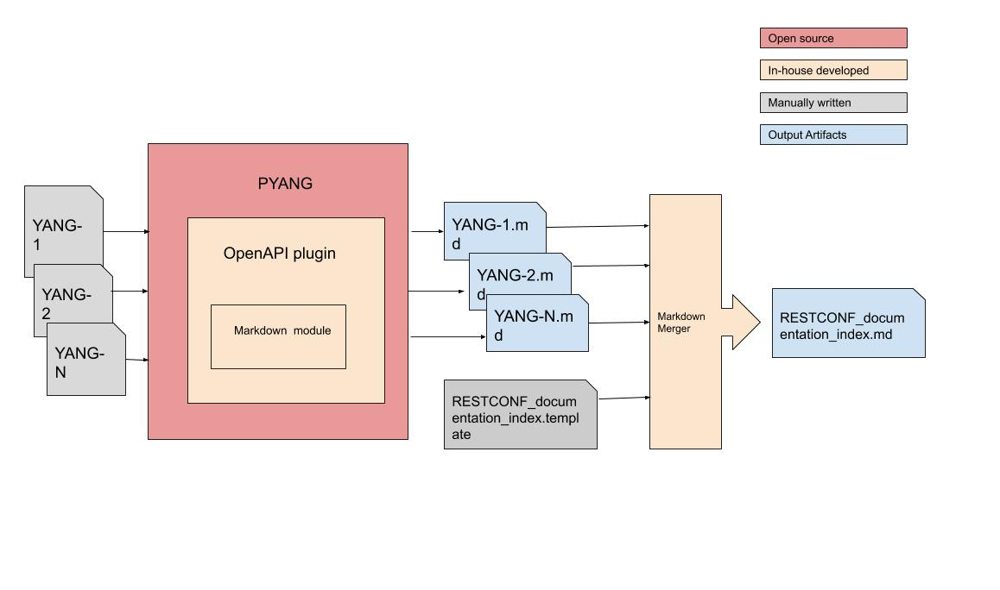

# The RESTCONF API document generator design
# High Level Design Document
### Rev 0.1

# Table of Contents
  * [Revision](#revision)
  * [About this Manual](#about-this-manual)
  * [Scope](#scope)
  * [Definitions/Abbreviation](#definitionsabbreviation)
  * [Introduction](#introduction)  
 
  * [1 Overview](#1-overview)
    * [1.1 Design Diagram](#11-system-chart)
    * [1.2 Modules description](#12-modules-description)
      * [1.2.1 Pyang](#121-pyang)
      * [1.2.2 OpenAPI plugin](#122-openapi-plugin)
      * [1.2.3 Markdown formatter](#123-markdown-formatter)
  * [2 Requirements](#2-requirements)
  * [3 Document Generation Approach](#3-document-generation-approach)
    * [3.1 Auto Generated document](#31-auto-generated-document)
    * [3.2 Manually written template document](#32-manually-written-template-document)
    * [3.3 Final Document](#33-final-document)    

###### Revision
| Rev |     Date    |       Author       | Change Description                |
|:---:|:-----------:|:------------------:|-----------------------------------|
| 0.1 |    01/08/2020         | Mohammed Faraaz      | Initial version       |

# About this Manual
This document provides general information about the design of the [RESTCONF 8040](https://tools.ietf.org/html/rfc8040) API document generator and the REST document syntax.

# Scope
This document describes only the high level design of the [RESTCONF 8040](https://tools.ietf.org/html/rfc8040) API document related components. It is intending to provide high level details about Pyang and its associated OpenAPI plugin.

# Introduction
The existing OpenAPI plugin for Pyang is enhanced to generate a document for RESTCONF API, it uses the same Utils and tools used by OpenAPI Plugin. The generated document will be in markdown(.md) format.

# Definitions/Abbreviation

| Definitions/Abbreviation | Description                                |
|--------------------------|--------------------------------------------|
| REST                     | Representational state transfer            |
| API                      | Application Programmable Interface         |

# 1 Overview

## 1.1 Design

Following diagram describes a RESTCONF API document generator design

Note:
Temporary using G-link above will change it actual file name after review.

## 1.2 Modules description

### 1.2.1 Pyang

Pyang is an open source YANG Parser written in Python, It parses the yang modules and provides yang data in a programmable object (python objects) format, this data is passed on to the OpenAPI plugin for OpenAPI spec and RESTCONF document generation.

### 1.2.2 OpenAPI Plugin

This is an extension plugin written on top of Pyang parser, it walks over the generated Yang data (present in a form of Python object) and generates a yang tree along with required metadata for the generation of OpenAPI spec (swagger spec 2.0) and a RESTCONF document for each yang module in a markdown (.md) format.

### 1.2.3 Markdown Formatter

It is an extension/module inside OpenAPI plugin, it walks over the yang tree produced and uses the same Utils and metadata generated by OpenAPI generator and generates a REST document in a markdown(.md) Format.

# 2 Requirements

* Tool shall generate RESTCONF compatible URIs and payload.
* Tool shall output the Request and Response payload for the URIs in a JSON format.
* Tool shall fetch the Description from the yang and describe the URIs in a generated document
* Tool shall list and describe the Parameters which will be part of URIs
* Tool shall generate a RESTCONF API document in a markdown(.md) format.
* Tool shall as part of build and can be turned off using an option in Makefile.
* Tool shall generate documents for both Standard and SONiC yang models.

# 3 Document Generation Approach

## 3.1 Auto Generated document

The RESTCONF document generation tool will generate one markdown (.md) file per Yang module. 
These auto-generated documents will be placed under sonic-mgmt-framework/build/restconf_md directory.
The auto-generated documents will have following sections
* Configuration APIs - Describes Configuration URIs i.e. config:true Yang statement.
* Operational-state APIs - Describes Operational-state URIs i.e. config:false Yang statement.
* Operations APIs - Describes RPCs defined in yang model.

## 3.2 Manually written template document

The base document known as RESTCONF_documentation_index.template is a manually written Jinja based markdown document which contains a static sections describing RESTCONF protocol itself, authentication, supported media types, RESTCONF capabilities, Response messages, protocol and transport requirements. This is a checked-in file.

## 3.3 Final Document

The final RESTCONF document called RESTCONF_documentation_index.md is auto-generated during build time which contains contents of static file described in above [3.2](#32-manually-written-template-document) and the hyperlinks to the RESTCONF document for individual Yang models generated in section [3.1](#31-auto-Generated-document).

