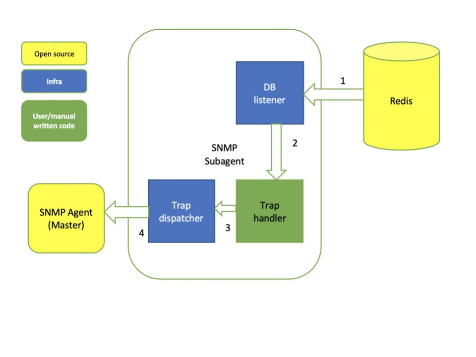

# The SNMP Python Subagent Trap Infrastructure design
# High Level Design Document
### Rev 0.1

# Table of Contents
  * [List of Tables](#list-of-tables)
  * [Revision](#revision)
  * [About this Manual](#about-this-manual)
  * [Scope](#scope)
  * [Definitions/Abbreviation](#definitionsabbreviation)
 
  * [1 Overview](#1-overview)
    * [1.1 Design](#11-system-chart)
    * [1.2 Modules description](#12-modules-description)
      * [1.2.1 SNMP sub-agent](#121-snmp-sub-agent)
      * [1.2.2 Redis DB](#122-Redis-DB)
      * [1.2.3 Agent](#123-Agent)

  * [2 Requirements](#2-requirements)

  * [3 Sub-Agent Modules Design](#3-sub-agent-modules-design)
    * [3.1 Modules that need to be Added](#31-modules-that-need-to-be-added)
      * [3.1.1 DB Listener](#311-db-listerner)
      * [3.1.2 Trap Handler](#312-trap-handler)
      * [3.1.3 Trap Dispatcher](#313-trap-dispatcher)

  * [4 Configurations](#4-configurations)

  * [5 Supported Traps](#5-supported-traps)
      * [5.1 Using Python Subagent](#51-using-python-subagent)
      * [5.2 Using FRR Subagent](#52-using-frr-subagent)

###### Revision
| Rev |     Date    |       Author       | Change Description                |
|:---:|:-----------:|:------------------:|-----------------------------------|
| 0.1 |    10/30/2019         | Mohammed Faraaz/Suresh Babu      | Initial version                   |
| 0.2 |    10/06/2020         | Suresh Babu                      | Updated config change trap        |

# About this Manual
This document provides general information about the design of the SNMP Python based Subagent's trap Infrastructure implementations in SONiC.

# Scope
This document describes the high level design of the SNMP Python based Subagent's trap Infrastructure. This document will only describe components involved in the trap infra and will not describe other components of subagent's infrastructure.

# Introduction
The current SNMP Python based Subagent which runs inside snmp container on SONiC OS lacks support for SNMP traps. The implementation describe in this manual tends to add a support for trap infrastructure to the subagent. 

# Definitions/Abbreviation
###### Table 2: Abbreviations
| Definitions/Abbreviation | Description                                |
|--------------------------|--------------------------------------------|
| SNMP                     | Simple Network Management Protocol         |
| API                      | Application Programmable Interface         |
| PDU                      | Protocol Data Units         |

# 1 Overview

## 1.1 Design
Following diagram describes a top level overview of the SONiC Trap Infrastructure



## 1.2 Modules description

### 1.2.1 SNMP sub-agent

Stores the information from Various DBs in the local cache and handles the SNMP requests and also process the traps by listening to DB notifications.

### 1.2.2 Redis DB

Redis DB runs inside the container "database". Redis DB works with the data in format of key-value tuples, needs no predefined schema and holds various SNMP counters under various logical DBs such as CONFIG_DB, ASIC_DB, etc.

### 1.2.3 Agent

A NET-SNMP Agent also known as Master which services the SNMP requests from SNMP clients.

# 2 Requirements

* System shall listen to DB's keyspace notifications and generate a SNMP trap
* System shall listen to DB's channel notifications and generate a SNMP trap
* System shall generate a NOTIFY PDU and notify the Master(Agent) and process the response if any.

# 3 Sub-Agent Module Enhancements

## 3.1 Modules that need to be Added

### 3.1.1 DB Listener

This is an infra component and this component is responsible for listening to DB's keys and channels for notifications. This component will be hooked into AgentX's event loop during init time.
When DB notifications are received this component invokes a set of Trap handlers registered against those specific DB keys and channels.

### 3.1.2 Trap Handler

This is an user written piece of code (class implementation) which prepares the trap data(VarBinds) required to be sent to the Master (SNMP Agent). Trap handlers are derived class of Trap base class (part of Trap infrastructure)

#### 3.1.2.1 Example

```python
class linkUpDownTrap(Trap):
    def __init__(self):
      """
      Registers a list keys for the Traps
      """
        super().__init__(dbKeys=["__keyspace@0__:LAG_TABLE:PortChannel*"])

    def trap_init(self):
        """
        Trap handler can use this step to prepare any
        Data structure or perform any preprocessing step
        This method will be invoked during 
        Trap registration phase
        """
    def trap_process(self, dbMessage, changedKey):
      """
      Builds Var binds and processes the DB events and returns
      a special dictionary when Trap needs to be sent otherwise
      return None
      returnDict = {"TrapOid": ObjectIdentifier(),
        varBinds": [ValueRepresentation()]
      }
      """
```
### 3.1.3 Trap Dispatcher

This is an infra component and this component is responsible for building a NOTIFY PDU (generation of Trap) and sends the Trap to the Master (Agent).
```
Below is the PDU prepared by this component
 (AgentX header)
    +-+-+-+-+-+-+-+-+-+-+-+-+-+-+-+-+-+-+-+-+-+-+-+-+-+-+-+-+-+-+-+-+
    | h.version (1) |  h.type (12)  |    h.flags    |  <reserved>   |
    +-+-+-+-+-+-+-+-+-+-+-+-+-+-+-+-+-+-+-+-+-+-+-+-+-+-+-+-+-+-+-+-+
    |                          h.sessionID                          |
    +-+-+-+-+-+-+-+-+-+-+-+-+-+-+-+-+-+-+-+-+-+-+-+-+-+-+-+-+-+-+-+-+
    |                        h.transactionID                        |
    +-+-+-+-+-+-+-+-+-+-+-+-+-+-+-+-+-+-+-+-+-+-+-+-+-+-+-+-+-+-+-+-+
    |                           h.packetID                          |
    +-+-+-+-+-+-+-+-+-+-+-+-+-+-+-+-+-+-+-+-+-+-+-+-+-+-+-+-+-+-+-+-+
    |                        h.payload_length                       |
    +-+-+-+-+-+-+-+-+-+-+-+-+-+-+-+-+-+-+-+-+-+-+-+-+-+-+-+-+-+-+-+-+

    (n.context) OPTIONAL
    +-+-+-+-+-+-+-+-+-+-+-+-+-+-+-+-+-+-+-+-+-+-+-+-+-+-+-+-+-+-+-+-+
    |                     Octet String Length (L)                   |
    +-+-+-+-+-+-+-+-+-+-+-+-+-+-+-+-+-+-+-+-+-+-+-+-+-+-+-+-+-+-+-+-+
    |  Octet 1      |  Octet 2      |   Octet 3     |   Octet 4     |
    +-+-+-+-+-+-+-+-+-+-+-+-+-+-+-+-+-+-+-+-+-+-+-+-+-+-+-+-+-+-+-+-+
    ...
    +-+-+-+-+-+-+-+-+-+-+-+-+-+-+-+-+-+-+-+-+-+-+-+-+-+-+-+-+-+-+-+-+
    |  Octet L - 1  |  Octet L      |       Padding (as required)   |
    +-+-+-+-+-+-+-+-+-+-+-+-+-+-+-+-+-+-+-+-+-+-+-+-+-+-+-+-+-+-+-+-+

    (n.vb)
    ...
```


[RFC Link to Notify PDU](https://tools.ietf.org/html/rfc2257#page-33)

# 4 Configurations

Below is the Click based CLI for configuring Trap collector

config snmptrap modify [OPTIONS] <SNMP Version> <SNMP TRAP SERVER IP
                              Address>

  Modify the SNMP Trap server configuration

Options:
  -p, --port TEXT  SNMP Trap Server port, default 162
  -v, --vrf TEXT   VRF Name mgmt/DataVrfName/None
  -c, --comm TEXT  Community
  -?, -h, --help   Show this message and exit.

After executing above CLI, please  stop/start snmp docker to reflect config change

# 5 Supported Traps
## 5.1 Using Python Subagent
* LinkUp
* LinkDown
* brcmSonicConfigChange (1.3.6.1.4.1.4413.1.2.2.1.2.0.1)
  "This notification is generated when running configuration was changed.
   Snmpd does not generate this notification immediately. It waits for 30 secs
   for another config change to avoid multiple notifications in case config
   is changed within 30 sec. If there is no config change within 30 sec then
   trap is generated. **NOTE: config changes from vtyssh shell does not generate
   this trap.**"

## 5.2 Using FRR Subagent
* ospfNbrStateChange
* ospfIfStateChange
* bgpEstablished
* bgpBackwardTransition
